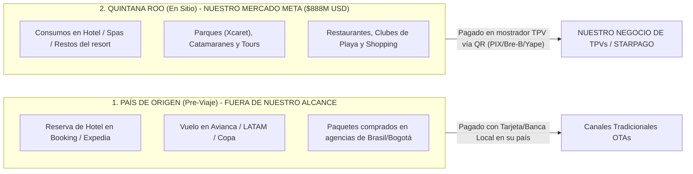

# ANÁLISIS COMERCIAL: RESERVAS EN ORIGEN vs. GASTO EN SITIO & ESTRATEGIA BILATERAL SPIN

**Desglose de Canales de Cobro y Diagnóstico de Negociación**  
**Proyecto:** Pagos Turísticos LATAM  
**Autor:** Antonio Gutiérrez  
**Fecha:** 7 de Agosto de 2026  

---

## ✈️ 1. DISTINCIÓN FUNDAMENTAL: ¿DÓNDE SÍ Y DÓNDE NO PARTICIPAMOS?

### **A. Lo que OCURRE EN ORIGEN (Pre-Viaje):**
* El turista compra su paquete de avión + hotel meses antes en agencias de su país (ej. Despegar, CVC Brasil, Avianca Tours).
* Ese dinero se queda en los bancos de origen. **Ahí NO participamos** porque son transacciones procesadas por pasarelas e-commerce globales.

### **B. Lo que OCURRE EN DESTINO (En Sitio - $888M USD):**
* El turista aterriza en Quintana Roo y empieza a gastar en los mostradores: tours locales, restaurantes, consumos de playa, spas, recuerdos y excursiones.
* **AQUÍ ES DONDE PARTICIPAMOS 100%:** Capturamos cada transacción en el punto de venta (TPV) a través de los códigos QR.

---

## 🔄 2. DIAGNÓSTICO: LA ESTRATEGIA BILATERAL DE FERNANDO CON SPIN (OXXO)

Fernando está buscando un **acuerdo Bilateral con Spin by OXXO**:

* **Flujo Inbound (Entrante):** Turista brasilero/colombiano paga con PIX/Bre-B en la red TPV de Spin en México.
* **Flujo Outbound (Saliente):** Mexicano que viaja a Brasil/Colombia paga con su tarjeta/app de Spin (OXXO) en comercios sudamericanos.

### **¿Por qué la negociación Bilateral con Spin se vuelve lenta y compleja?**

1. **Spin es un gigante concentrado en Retail Doméstico:** Spin (FEMSA) tiene más de 10 millones de usuarios en México, pero su prioridad #1 es el mercado doméstico (depósitos en tiendas OXXO, recargas de saldo y pago de servicios).
2. **Complejidad Regulatoria Bilateral:** Un acuerdo "bilateral" exige integraciones cambiarias (FX) de dos vías y cumplimiento normativo ante el Banco Central do Brasil y el Banco de la República de Colombia.
3. **El Roadblock:** Para Spin, el flujo *outbound* (mexicanos viajando a Sudamérica) es un volumen pequeño comparado con su negocio core de OXXO, por lo que lo mandan al fondo de su backlog técnico (12 a 18 meses de espera).

---

## 💡 LA SOLUCIÓN PRÁCTICA (APROVECHAR EL FOCUS INBOUND)

Para no quedarse atorado esperando a que Spin desarrolle el sistema bilateral complejo:

1. **Enfocarse al 100% en el Flujo Inbound (Turistas en Quintana Roo):** Es donde está la derrama económica inmediata de **$888M USD**.
2. **Utilizar un Procesador PSP Ágil (Starpago):** Starpago ya tiene la capacidad de procesar los APMs de entrada (Inbound) y liquidar en SPEI a los comercios de FETUR de inmediato, sin esperar 18 meses a que Spin complete un desarrollo bilateral.

*Análisis comercial de canales de venta y viabilidad bilateral guardado en `riviera-maya-payments`.*
