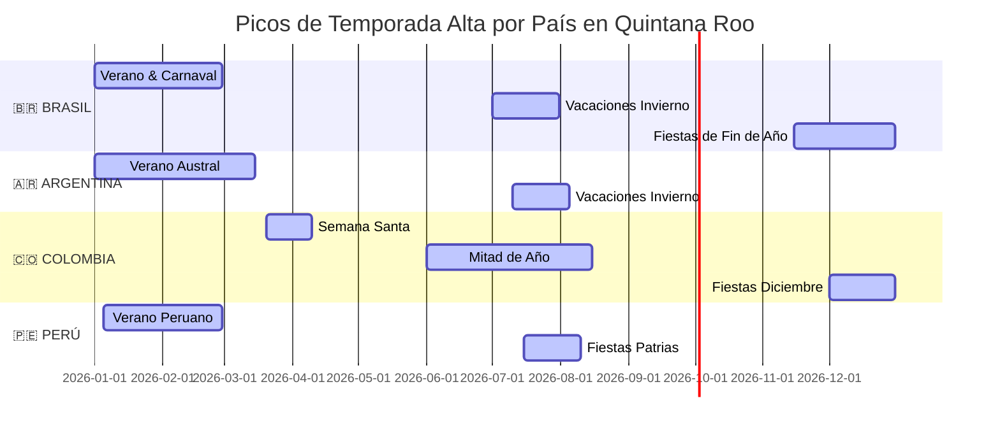

# ANÁLISIS DE TEMPORALIDAD Y ESTACIONALIDAD DEL TURISMO SUDAMERICANO EN QUINTANA ROO

**Mapeo Mensual de Flujos por País y Estrategia de Balanceo de Temporada Baja**  
**Proyecto:** Pagos Turísticos LATAM (PIX, Bre-B, Yape, Mercado Pago)  
**Autor:** Antonio Gutiérrez — Estratega de Tecnología y Soluciones de Pago B2B  
**Fecha:** 7 de Agosto de 2026  

---

## 📅 1. EL CALENDARIO DE TEMPORADA ALTA POR PAÍS DE ORIGEN

A diferencia del turista estadounidense o canadiense (que viaja principalmente de Diciembre a Marzo), el turista sudamericano tiene **picos vacacionales repartidos a lo largo de TODO el año** debido al calendario escolar del Hemisferio Sur y festividades nacionales.

---

## 📊 2. DESGLOSE DE PICOS DE AFLUENCIA POR NACIONALIDAD

### 🇧🇷 **BRASIL (Picos: Enero-Febrero, Julio, Noviembre-Diciembre)**
* **Pico 1 (Enero - Febrero):** Verano brasilero y temporada de Carnaval.
* **Pico 2 (Julio):** Vacaciones escolares de invierno en Brasil (las familias brasileñas viajan en masa al Caribe).
* **Pico 3 (Noviembre - Diciembre):** Réveillon y fiestas de fin de año.

### 🇨🇴 **COLOMBIA (Picos: Junio-Agosto, Semana Santa, Diciembre)**
* **Pico 1 (Junio - Julio - Agosto):** Temporada de receso escolar de mitad de año (pico histórico de colombianos en Cancún).
* **Pico 2 (Marzo - Abril):** Semana Santa y Pascua.
* **Pico 3 (Diciembre):** Temporada de fin de año.

### 🇦🇷 **ARGENTINA (Picos: Enero-Marzo, Julio)**
* **Pico 1 (Enero - Marzo):** Verano austral (escapada a las playas del Caribe mexicano).
* **Pico 2 (Julio):** Vacaciones de invierno en Argentina.

### 🇵🇪 **PERÚ (Picos: Julio-Agosto, Enero-Febrero)**
* **Pico 1 (Julio - Agosto):** Fiestas Patrias peruanas (28 de Julio) + vacaciones escolares.
* **Pico 2 (Enero - Febrero):** Verano peruano.

---

## 💡 3. EL VALOR COMERCIAL CLAVE: "SUPLIR LA TEMPORADA BAJA DE EE.UU."

Para los hoteles y restaurantes afiliados a FETUR en Quintana Roo:

1. **El Problema del Comercio:** Entre **Mayo, Junio, Julio y Agosto**, la afluencia de turistas de Estados Unidos y Canadá cae significativamente (temporada baja tradicional de América del Norte).
2. **La Solución Sudamericana:** En esos mismos meses (Junio, Julio y Agosto), **Colombia, Brasil y Perú tienen sus PICOS MÁXIMOS de vacaciones de mitad de año**.
3. **El Beneficio:** Habilitar cobros fluidos por QR en APMs **permite a los comercios de FETUR capturar el flujo sudamericano para llenar sus habitaciones y mesas durante la temporada baja norteamericana**.

---

*Análisis de temporalidad y estacionalidad guardado en `riviera-maya-payments`.*
