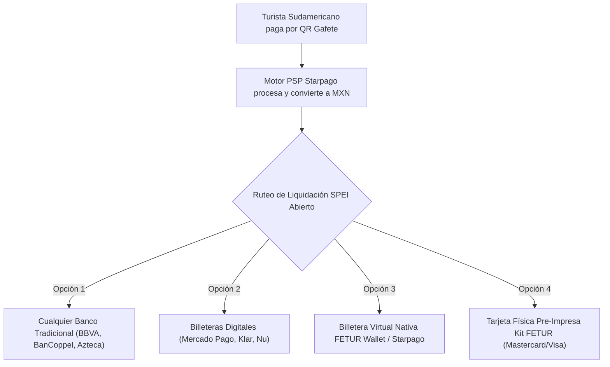

# ARQUITECTURA FINTECH AGNOSTICA: MODELO SIN DEPENDENCIA DE SPIN (MULTI-BANCO Y WALLET NATIVA)

**Resiliencia Operativa y Redundancia de Emisores (Cero Single Point of Failure)**  
**Proyecto:** Pagos Turísticos LATAM (PIX, Bre-B, Yape, Mercado Pago)  
**Autor:** Antonio Gutiérrez — Estratega de Tecnología y Soluciones de Pago B2B  
**Fecha:** 7 de Agosto de 2026  

---

## 🛡️ PRINCIPIO DE ARQUITECTURA: CERO DEPENDENCIA DE UN SOLO ACTOR

Si Spin by OXXO decide no participar o tarda en sus comités, **EL PROYECTO NO SE DETIENE NI UN SOLO DÍA**. 

El sistema de Starpago es **100% agnóstico** a nivel de liquidación por SPEI.

---

## 💳 LAS 4 ALTERNATIVAS SI NO ES SPIN:

### **1. Cualquier Banco o Billetera Existente en México (Multi-CLABE SPEI)**
El comerciante informal simplemente ingresa los 18 dígitos de su CLABE de cualquier cuenta personal que ya tenga activa:
* **BanCoppel:** Cobertura masiva en Quintana Roo con sucursales abiertas de lunes a domingo.
* **Banco Azteca (Guardadito):** Muy popular en micro-comerciantes y trabajadores independientes.
* **BBVA México (Cuenta Digital):** La cuenta de débito digital más usada en el país.
* **Mercado Pago México / Saldazo Banamex.**
* **Fintechs (Nu México, Klar, Stori).**

---

### **2. Billetera Virtual Nativa (FETUR Pay Web Wallet)**
* **Cómo funciona:** La Web-App PWA de Starpago incluye un saldo en vivo en Pesos MXN.
* **El comercio puede:**
  1. Acumular sus ventas y transferir a cualquier CLABE cuando él quiera.
  2. Utilizar códigos de **Retiro de Efectivo Sin Tarjeta** en cajeros automáticos (BBVA / Banorte).

---

### **3. Kit Físico con Tarjeta Pre-Activada (Mastercard / Visa Co-Branded)**
* **Cómo funciona:** Vía un emisor de BaaS (Banking as a Service como Pomelo, Galileo o TruBit), se emiten **5,000 Tarjetas de Débito Físicas Mastercard FETUR Pay**.
* **Entrega en Campo:** Al afiliar al lanchero o artesano en el muelle, el promotor le entrega su **Kit Físico:**
  * **Cartel/Gafete QR** para colgarse al cuello.
  * **Tarjeta de Débito Mastercard FETUR Pay** pre-activada en el sobre donde caerán sus depósitos de inmediato.

---

## 🎯 RESUMEN DE SEGURIDAD OPERATIVA PARA PITCH:

> *"Nuestro modelo no depende de Spin ni de ningún banco en particular. La pasarela es 100% agnóstica: liquida vía SPEI en tiempo real a cualquier CLABE del sistema financiero mexicano (BanCoppel, BBVA, Banco Azteca, Mercado Pago) o a la tarjeta física pre-entregada del programa."*

---

*Arquitectura agnóstica sin dependencia de Spin guardada en `riviera-maya-payments`.*
