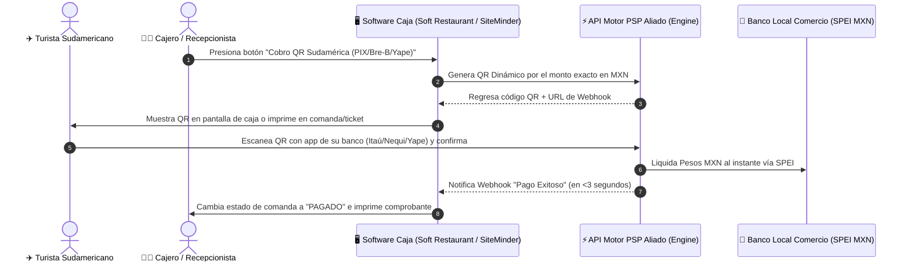

# ARQUITECTURA ZERO-HARDWARE: INTEGRACIÓN NATIVA PMS/POS (SOFT RESTAURANT, OPERA, SITEMINDER)

**Modelo de Despliegue Directo API:** Eliminación de TPVs Físicas y Agregadores Locales  
**Proyecto:** Pagos Turísticos LATAM (PIX, Bre-B, Yape)  
**Autor:** Antonio Gutiérrez  
**Fecha:** 7 de Agosto de 2026  

---

## 💥 EL GRAN DESCUBRIMIENTO DE ARQUITECTURA

**¡EXACTO! NO SE NECESITA NINGUNA TPV FÍSICA (CLIP, MERCADO PAGO, NETPAY).**

Al migrar a una **Arquitectura Zero-Hardware impulsada por Software PMS / POS**:
1. **Se eliminan los agregadores de tarjetas locales** (Clip, Netpay, etc.), reteniendo el 100% del margen de comisión para **Motor PSP Aliado y Antonio**.
2. **Se eliminan los costos y mantenimiento de terminales físicas**.
3. **Se escala de forma masiva:** Una sola integración API con 3 softwares de gestión habilita al 85% de los hoteles y restaurantes de Quintana Roo.

---

## 🔄 EL WORKFLOW OPERATIVO ZERO-HARDWARE (EN 3 SEGUNDOS)

---

## 🏆 LOS 3 GIGANTES DEL SOFTWARE TURÍSTICO A INTEGRAR

### **1. Soft Restaurant (National Soft)**
* **Cobertura:** Líder absoluto en México para restaurantes, bares, clubes de playa y taquillas de parques. Cobertura del **>75% del sector gastronómico de Quintana Roo**.
* **Integración:** Módulo de pagos externos / API de pasarela nativa.
* **Experiencia:** El mesero presiona "Pago QR Sudamérica" en la pantalla touch, imprime la comanda con el QR dinámico o muestra el QR en la pantalla de la terminal de mesa.

### **2. Opera PMS (Oracle Hospitality) & Infor HMS**
* **Cobertura:** El estándar de oro mundial en hotelería. Presente en más del **80% de los resorts All-Inclusive y hoteles de cadena** en Cancún y Riviera Maya.
* **Integración:** API Folio / Checkout Payment Gateway.
* **Experiencia:** Al hacer Checkout o pagar consumos del Spa, el recepcionista muestra el QR en la pantalla de recepción.

### **3. SiteMinder / Cloudbeds / Bitoon**
* **Cobertura:** El Channel Manager y PMS líder para **hoteles boutique, villas y rentas vacacionales** en Tulum y Playa del Carmen.
* **Integración:** Webhook Payment Button.
* **Experiencia:** Permite enviar un enlace de cobro QR por WhatsApp o mail al huésped durante su estancia para saldar consumos.

---

## 💰 VENTAJAS FINANCIERAS Y COMERCIALES IMBATIBLES

1. **Cero Repartición de Comisión con Agregadores:** Al no usar TPVs de terceros (Clip, Netpay), la tarifa de procesamiento (**2.0% a 3.0%**) se queda **100% entre Motor PSP Aliado y Antonio**.
2. **Cero Fricción para el Comercio:** El hotelero o restaurantero no firma contratos con bancos ni rentas de TPVs. Solo activa el botón en su software de caja que ya usa todos los días.
3. **Escalabilidad Masiva:** En lugar de afiliar comercios 1 por 1, la alianza estratégica con Soft Restaurant o SiteMinder conecta a **miles de establecimientos de golpe**.

---

*Arquitectura Zero-Hardware registrada en el repositorio `riviera-maya-payments`.*
