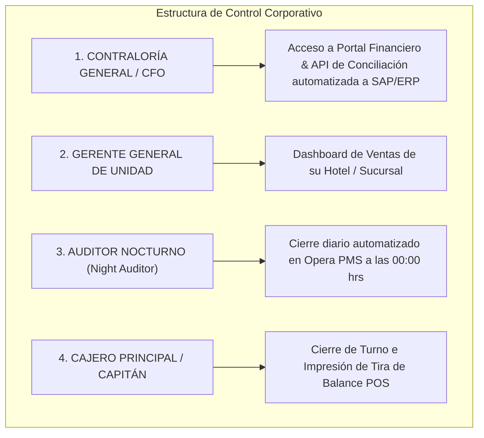

# ARQUITECTURA DE CONCILIACIÓN ENTERPRISE PARA CADENAS HOTELES Y RESTAURANTES

**Modelo de Auditoría Corporativa y Automatización Contable:** Operación para Cadenas y Grupos (Sin Dependencia del Dueño)  
**Proyecto:** Pagos Turísticos LATAM  
**Autor:** Antonio Gutiérrez — Estratega de Tecnología y Soluciones de Pago B2B  
**Fecha:** 7 de Agosto de 2026  

---

## 🏢 LA REALIDAD OPERATIVA CORPORATIVA

En grandes cadenas de restaurantes (ej. Grupo Anderson's, Rosa Negra) y grupos hoteleros (ej. Meliá, Hyatt, Xcaret):
1. **Los dueños NO están en el día a día operativo** ni reciben alertas de WhatsApp en sus celulares personales.
2. La operación contable es gestionada por la **Dirección de Finanzas, Contraloría General y Auditoría Nocturna**.
3. Requieren **Conciliación Automatizada de 3 Vías** (POS = Procesador = Estado de Cuenta Bancario) integrable con sus ERPs corporativos (**SAP, Oracle Financials, CONTPAQi**).

---

## ⚙️ ESTRUCTURA DE ROLES Y NIVELES DE ACCESO (RBAC)

---

## 🛠️ LOS 3 PILARES DE LA CONCILIACIÓN ENTERPRISE AUTOMATIZADA

### **1. Conciliación Automatizada a ERP Corporativo (SAP / Oracle Financials / CONTPAQi)**
* **Envío Automatizado (Batch 00:01 AM):** Todas las madrugadas, la plataforma emite un archivo estructurado de conciliación (**CSV / MT940 / XML**) que se inyecta directamente vía API o SFTP al ERP contable de la cadena.
* **Conciliación de 3 Vías (Three-Way Matching):** El ERP empareja automáticamente:
  1. La venta registrada en la comanda del POS (*Soft Restaurant / Opera*).
  2. El folio del cobro autorizado en la pasarela.
  3. El depósito bancario en MXN recibido vía SPEI.
* **Cero intervención manual:** El departamento de contabilidad solo revisa reportes de excepciones (si existe alguna discrepancia).

---

### **2. Integración con la Auditoría Nocturna (Night Audit en Opera PMS)**
En los grandes resorts All-Inclusive y hoteles de cadena:
* Durante el proceso de **Auditoría Nocturna (Night Audit)** que se ejecuta a la medianoche en Opera PMS, el sistema genera automáticamente la hoja de balance entre los folios cobrados y la cuenta concentradora.
* Si el balance cuadra al 100%, la jornada se cierra de forma automática sin intervención humana.

---

### **3. Cierres por Turno e Impresión de Tira de Balance (POS)**
* Para los supervisores de restaurantes y bares:
* Al finalizar el turno del almuerzo o cena, el cajero presiona el botón **"Cierre de Turno APM"** en *Soft Restaurant*.
* El sistema imprime la **tira física de balance** con la suma total de cobros por PIX, Bre-B y Yape, la cual se anexa física o digitalmente al sobre de depósito de caja.

---

## 🎯 RESUMEN COMERCIAL PARA CONTRALORES Y DIRECTORES DE TI:

> *"Sabemos que en un grupo hotelero o cadena de restaurantes la prioridad es la automatización contable. Nuestro sistema no requiere revisiones manuales: cada madrugada inyectamos el archivo de conciliación directamente a su ERP (SAP/CONTPAQi) haciendo un match automático de 3 vías entre la comanda del POS, nuestro folio y el depósito bancario. Además, se integra directamente a la Auditoría Nocturna de Opera PMS."*

---

*Arquitectura de conciliación corporativa enterprise guardada en `riviera-maya-payments`.*
