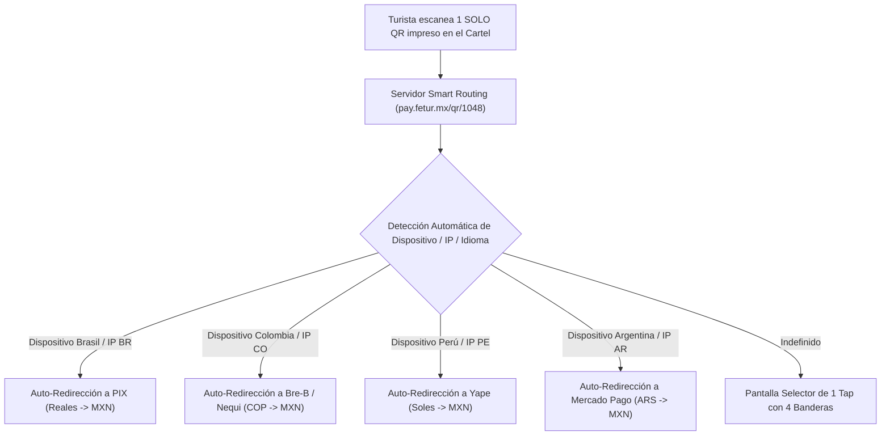

# ARQUITECTURA TÉCNICA DE 1 SOLO QR INTELIGENTE (SMART MULTI-COUNTRY QR)

**Explicación de Viabilidad y Ruteo Dinámico por País**  
**Proyecto:** Pagos Turísticos LATAM (PIX, Bre-B, Yape, Mercado Pago)  
**Autor:** Antonio Gutiérrez — Concepto y Arquitectura de Producto  
**Fecha:** 7 de Agosto de 2026  

---

## 🎯 LA RESPUESTA TÉCNICA: SÍ, 100% ES POSIBLE USAR 1 SOLO QR

Usar **1 solo código QR en el cartel** que identifique automáticamente el país de origen del turista es **totalmente viable y es el estándar de la industria Fintech internacional (Smart Routing QR)**.

Existen **2 esquemas técnicos** para lograrlo:

---

## 🔄 ESQUEMA A: SMART DYNAMIC WEB-LANDING (REDIRECCIÓN POR USER-AGENT / IP)

### **Cómo funciona la magia técnica:**
1. **La URL del QR:** El QR impreso en el cartel contiene una URL corta inteligente (ejemplo: `pay.fetur.mx/qr/HOTEL-TULUM-01`).
2. **La Detección Instantánea (Milisegundos):** Al escanear el QR con la cámara del celular, el servidor lee en el primer milisegundo:
   * El **User-Agent** (idioma y configuración regional del teléfono: `pt-BR`, `es-CO`, `es-PE`, `es-AR`).
   * Las **Apps Instaladas** o esquema de Deep Linking (`pix://`, `nequi://`, `yape://`).
   * La **IP del operador celular / Roaming** de origen.
3. **El Resultado:** Si el turista es brasileño, el teléfono abre de inmediato el flujo de **PIX en Reales**; si es colombiano, abre **Bre-B/Nequi en Pesos Colombianos**.

---

## 🌐 ESQUEMA B: ESTÁNDAR INTERNACIONAL EMVCo UNIFIED QR PAYLOAD

* **El Estándar Global:** El Banco Central do Brasil (PIX) y las redes interoperables de LATAM operan bajo el estándar **EMVCo QR Code Specification**.
* **Unified Payload:** El QR de la pasarela (Starpago) empaca múltiples identificadores de merchant dentro de la misma cadena de caracteres. La app bancaria de origen (ej. Itaú en Brasil) reconoce su propia llave de pago dentro del estándar.

---

## 📋 PREGUNTAS TÉCNICAS PARA FERNANDO / STARPAGO

Para tu próxima reunión con Fernando o con el equipo de tecnología de Starpago, puedes hacerles exactamente estas 3 preguntas de nivel experto:

1. ❓ *"¿La pasarela de Starpago genera la redirección de 1 solo QR mediante **Smart Web-Landing con detección de User-Agent/IP** o vía **EMVCo Unified Payload**?"*
2. ❓ *"¿El Smart QR ejecuta **Deep-Linking nativo** a las apps bancarias de origen (`pix://`, `nequi://`, `yape://`) al escanear?"*
3. ❓ *"¿Si el User-Agent es ambiguo, la Web-Landing despliega el selector limpio de 1-Tap con las 4 banderas (Brasil 🇧🇷, Colombia 🇨🇴, Perú 🇵🇪, Argentina 🇦🇷)?"*

---

*Arquitectura de 1 solo QR inteligente registrada en `riviera-maya-payments`.*
