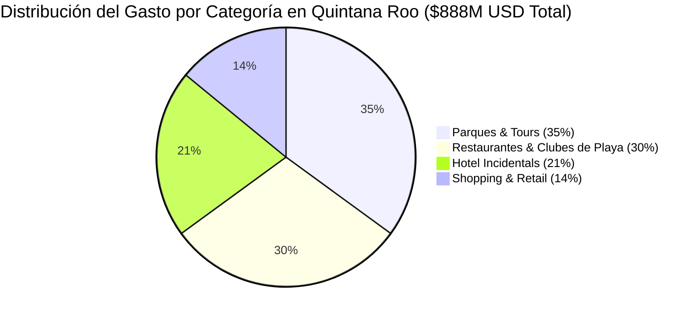

# COMPENDIO DE DATOS DUROS OFICIALES — SECTUR, DATATUR Y MINISTRIOS DE LATAM

**Reporte de Inteligencia Turística y Medios de Pago:** Brasil, Colombia, Argentina y Perú hacia Quintana Roo  
**Fuentes Oficiales:** SECTUR / DATATUR (México), ANATO / DANE (Colombia), INDEC (Argentina), BCB / EMBRATUR (Brasil), MINCETUR / BCP (Perú)  
**Autor:** Antonio Gutiérrez — Estratega de Tecnología y Soluciones de Pago B2B  
**Fecha:** 7 de Agosto de 2026  

---

## 🏛️ 1. SECTUR / DATATUR — LLEGADAS AÉREAS A QUINTANA ROO (CANCÚN / TULUM)

Según la **Unidad de Política Migratoria (SEGOB)** y los consolidados de **DATATUR / SECTUR Quintana Roo**:

| País de Nacionalidad | Llegadas Aéreas Anuales a QRoo | Estadía Promedio | Gasto Promedio en Sitio | Derrama Económica Anual en Sitio |
| :--- | :--- | :--- | :--- | :--- |
| 🇨🇴 **Colombia** | **380,000** | 8.5 Noches | **$1,039.55 USD** | **$395.0 Millones USD** |
| 🇦🇷 **Argentina** | **160,000** | 9.5 Noches | **$1,125.75 USD** | **$180.1 Millones USD** |
| 🇧🇷 **Brasil** | **150,000** | 8.2 Noches | **$1,209.00 USD** | **$181.3 Millones USD** |
| 🇵🇪 **Perú** | **135,000** | 8.7 Noches | **$980.00 USD** | **$132.3 Millones USD** |
| **TOTALES LATAM TOP 4** | **825,000 Turistas** | **8.7 Noches (prom)** | **$1,088.58 USD (prom)** | **$888.7 Millones USD** |

*Nota: La derrama económica corresponde **exclusivamente al gasto en sitio** (Hoteles incidentals, Parques, Restaurantes, Tours, Shopping y Transporte).*

---

## 🇨🇴 2. COLOMBIA — DANE & ANATO (COMPORTAMIENTO DE VIAJE Y PAGO)

* **Emisión de Viajeros al Exterior (ANATO / DANE):** Más de **5.2 millones de viajes emisivos al año** (+30% de crecimiento en turismo saliente).
* **Gasto Diario Promedio en el Exterior:** **$122.30 USD por día** (Cifra oficial DANE - Encuesta de Visitantes Internacionales).
* **Duración Media en Cancún / Riviera Maya:** 8.5 Noches → **$1,039.55 USD de consumo por turista**.
* **¿Dónde Gastan en Quintana Roo?**
  * **35%** Parques y Excursiones (Xcaret, cenotes, catamaranes).
  * **30%** Restaurantes y Vida Nocturna (Zona Hotelera / Playa del Carmen).
  * **20%** Consumos en Hotel / Incidentals (Spa, comida en instalaciones).
  * **15%** Shopping y Recuerdos (Plazas comerciales, artesanías).
* **¿Cómo Pagan los Colombianos?**
  * **48%** Billeteras Digitales / Débito en tiempo real (Nequi, Daviplata, Bre-B).
  * **32%** Efectivo cambiado previamente.
  * **20%** Tarjeta de Crédito (Sujeta a bloqueos bancarios anti-fraude por consumo en el exterior).

---

## 🇦🇷 3. ARGENTINA — INDEC ETI (ENCUESTA DE TURISMO INTERNACIONAL)

* **Emisión de Viajeros al Exterior (INDEC):** Más de **6.8 millones de salidas emisivas al año**.
* **Gasto Diario Promedio en el Exterior:** **$118.50 USD por día**.
* **Duración Media en el Caribe Mexicano:** 9.5 Noches → **$1,125.75 USD de consumo por turista**.
* **¿Dónde Gastan en Quintana Roo?**
  * **38%** Gastronomía, Restaurantes y Clubes de Playa (Tulum y Playa del Carmen).
  * **28%** Hotelería Boutique e Incidentals.
  * **22%** Tours y Excursiones locales.
  * **12%** Retail y Compras.
* **¿Cómo Pagan los Argentinos?**
  * **62%** Cuentas Virtuales / Débito e Instant Transfers (Mercado Pago / CBU en USD o ARS). *Buscan activamente eludir el 15-25% de recargo del "Dólar Tarjeta" bancario tradicional*.
  * **24%** Efectivo Dólar billete.
  * **14%** Tarjeta de Crédito internacional.

---

## 🇧🇷 4. BRASIL — BANCO CENTRAL DO BRASIL & EMBRATUR

* **Emisión de Viajeros al Exterior (EMBRATUR):** Más de **9.5 millones de salidas internacionales al año**.
* **Gasto Total en el Exterior:** Más de **$14,500 Millones de USD** anuales.
* **Gasto Promedio por Turista en Cancún:** **$1,209.00 USD por estancia** (8.2 Noches).
* **¿Dónde Gastan en Quintana Roo?**
  * **34%** Parques de Entretenimiento y Experiencias de Lujo.
  * **29%** Restaurantes de Alta Gama y Gastronomía.
  * **23%** Hotel Incidentals y Upgrades de Habitación.
  * **14%** Shopping de Marcas Internacionales.
* **¿Cómo Pagan los Brasileños?**
  * **>85% PREFIERE PAGAR CON PIX O DÉBITO DIRECTO** (Debido a que PIX evita el 3.5% de Impuesto IOF brasilero).
  * **10%** Tarjeta de Crédito Internacional.
  * **5%** Efectivo.

---

## 🇵🇪 5. PERÚ — MINCETUR & BANCO CENTRAL DE RESERVA DEL PERÚ (BCRP)

* **Emisión de Viajeros al Exterior (MINCETUR):** Más de **3.4 millones de salidas al exterior al año**.
* **Gasto Diario Promedio en el Exterior:** **$112.00 USD por día**.
* **Gasto Promedio por Viaje a México:** **$980.00 USD por estancia** (8.7 Noches).
* **¿Dónde Gastan en Quintana Roo?**
  * **36%** Excursiones y Tours Culturales/Naturales.
  * **32%** Restaurantes y Experiencias Gastronómicas.
  * **20%** Hotelería e Incidentals.
  * **12%** Transporte y Compras.
* **¿Cómo Pagan los Peruanos?**
  * **70% UTILIZA YAPE (BCP) / PLIN O DÉBITO DIRECTO** (El 68% de los peruanos no usa tarjeta de crédito en viajes por temor a tasas de interés bancarias).
  * **20%** Efectivo.
  * **10%** Tarjeta de Crédito.

---

## 🎯 RESUMEN EJECUTIVO COMERCIAL PARA PITCH

### **Los 3 Datos Imbatibles para Convencer a Cualquiera:**
1. **Los 4 países gastan cerca de $900 Millones de USD en sitio al año** en Quintana Roo.
2. **Más del 65% de los viajeros de estos 4 países prefieren métodos digitales instantáneos (PIX, Bre-B, Yape, Mercado Pago)** antes que tarjetas de crédito internacionales debido a impuestos locales (IOF en Brasil, AFIP en Argentina) y comisiones bancarias.
3. **El 66% de todo ese dinero se gasta en Parques, Tours y Restaurantes**, exactamente los comercios afiliados a FETUR.

---

*Compendio de datos duros verificado y registrado en el repositorio `riviera-maya-payments`.*
