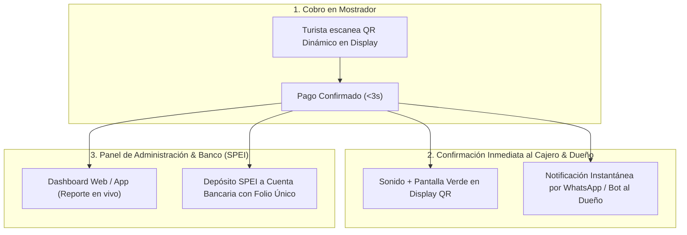

# ARQUITECTURA DE CONCILIACIÓN Y CONTROL EN TIEMPO REAL PARA EL COMERCIO

**Garantía de Transparencia, Control y Auditoría:** Display QR Dinámico y Panel de Administración  
**Proyecto:** Pagos Turísticos LATAM (PIX, Bre-B, Yape)  
**Autor:** Antonio Gutiérrez  
**Fecha:** 7 de Agosto de 2026  

---

## 🎯 EL RETO DE CONFIANZA DEL DUEÑO DEL NEGOCIO

Cuando un comercio pequeño (agencia de tours, hotel boutique, restaurante) utiliza un **Display QR Dinámico de Mostrador**:
1. El cajero necesita confirmación instantánea de que el cobro pasó.
2. El dueño o administrador necesita **garantizar que cada peso cobrado por QR fue depositado en su cuenta de banco en tiempo real**.
3. La contadora requiere **conciliación de auditoría 1 a 1 (Cierre de caja y folios SPEI)**.

---

## 🛡️ LOS 4 MECANISMOS DE GARANTÍA Y CONCILIACIÓN EN TIEMPO REAL

---

### 1. 🔔 NOTIFICACIÓN MULTICANAL INSTANTÁNEA (WHATSAPP / BOT AL DUEÑO)
En el segundo exacto en que el turista confirma el pago en su app bancaria (PIX/Bre-B/Yape), el teléfono del dueño o gerente recibe un mensaje automático por WhatsApp o Bot de Telegram:

> 🟢 **PAGO RECIBIDO — FETUR PAY**  
> **Comercio:** Hotel Boutique Tulum  
> **Monto Liquidado:** $2,450.00 MXN  
> **Origen:** PIX (Brasil)  
> **Cajero / Turno:** Recepción Turno Matutino (PIN 402)  
> **Folio Único:** `FETUR-TXN-98412`  
> **Estado SPEI:** Depositado a cuenta BBVA *4812 en tiempo real.

---

### 2. 📱 DASHBOARD EN VIVO Y CONTROL DE CAJEROS POR TURNO
* **Visualización en Vivo:** El dueño o administrador tiene una App/Portal Web en su celular donde ve caer cada venta en tiempo real como un feed en vivo.
* **Control de Cajeros:** Cada recepcionista o cajero tiene un PIN de 4 dígitos para ingresar al Display QR. Así el dueño sabe qué cajero cobró qué monto.
* **Reporte de Cierre de Caja (Z-Report):** Al terminar el turno, el sistema genera automáticamente un **PDF/Excel de Cierre de Caja** descargable con un solo clic.

---

### 3. 🏦 CONCILIACIÓN BANCARIA 1 A 1 (MATCH DE FOLIOS SPEI)
Para que la contadora o dueño no tenga dudas al revisar la banca empresarial (BBVA Net Cash, Banorte PyME, Santander):
* **Concepto de Pago SPEI Personalizado:** El depósito SPEI que llega a la cuenta bancaria del negocio incluye en la referencia el **mismo folio único del ticket (`FETUR-TXN-98412`)**.
* De este modo, conciliar la contabilidad es hacer un *Match* instantáneo de 1 a 1 entre el reporte del portal y el estado de cuenta bancario.

---

### 4. 📺 PANTALLA Y AUDIO DE CONFIRMACIÓN EN EL DISPLAY QR DE MOSTRADOR
Para que el cajero de mostrador sepa que no se le están haciendo "trampas" o capturas de pantalla falsas:
* El Display QR emite un **sonido característico ("¡Ching!")** y cambia a una pantalla verde gigante con la leyenda: **"PAGO VERIFICADO EN SISTEMA - $1,500.00 MXN"**.
* El código QR dinámico se destruye inmediatamente tras el pago (no se puede volver a escanear ni reutilizar).

---

## 🎯 RESUMEN COMERCIAL PARA TRANQUILIZAR AL DUEÑO:

> *"Don [Nombre del Dueño], con nuestro sistema usted tiene control total en la palma de su mano. Cada vez que un turista paga por el QR en el mostrador, a su celular le llega un WhatsApp de confirmación en tiempo real con el folio del depósito en su banco. Además, al final del día su cajero le genera el reporte de cierre en PDF donde cada peso coincide exactamente con su estado de cuenta bancario."*

---

*Arquitectura de conciliación y control en tiempo real guardada en `riviera-maya-payments`.*
