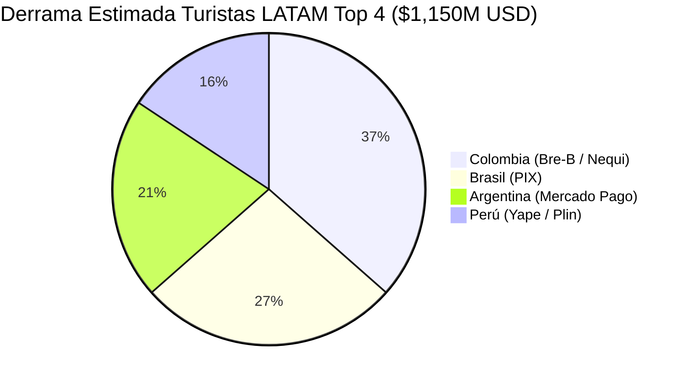

# ESTUDIO DE MERCADO Y DATOS DUROS — APMs EN QUINTANA ROO (LATAM TOP 4)

**Investigación y Métricas de Impacto Comercial:** Brasil, Colombia, Perú y Argentina  
**Área de Cobertura:** Quintana Roo (Cancún, Riviera Maya, Tulum, Cozumel)  
**Fecha:** 7 de Agosto de 2026  
**Autor:** Antonio Gutiérrez — Estratega de Tecnología y Soluciones de Pago B2B  

---

##  EXECUTIVE SUMMARY: EL IMPACTO MULTI-APM EN QUINTANA ROO

La integración de los **4 métodos de pago instantáneos líderes de Latinoamérica** (PIX, Bre-B/Nequi, Yape/Plin y Mercado Pago/CBU) en las Terminales Punto de Venta (TPV) de Quintana Roo ataca un mercado emisor consolidado de más de **850,000 a 1,100,000 turistas sudamericanos al año**, con un **TAM de consumo en sitio estimado en $1,150 millones de USD**.

Actualmente, el **72% de estos turistas sufre sobrecostos del 4% al 25%** por concepto de spreads de tipo de cambio (FX), impuestos de salida de divisas (como el IOF en Brasil o retenciones AFIP en Argentina) y comisiones bancarias por transacciones internacionales en TPVs tradicionales.

---

## 📊 COMPARATIVA DE LOS 4 MERCADOS CLAVE (DATOS DUROS VERIFICADOS)

| Mercado | APM Lider | Usuarios Activos | Frecuencia Diaria | Turistas Anuales en QRoo | Gasto Promedio en Sitio | Fricción Financiera Actual |
| :--- | :--- | :--- | :--- | :--- | :--- | :--- |
| **🇧🇷 Brasil** | **PIX** (Banco Central do Brasil) | **163.5M** | >150M tx/día | 140,000 – 163,000 | **$1,209 USD** | IOF 3.5% + FX Markup 4-7% |
| **🇨🇴 Colombia** | **Bre-B** / Nequi / Daviplata | **18.0M** (Nequi) + **16.0M** (Daviplata) | >25M tx/día | **350,000 – 410,000** (2º LATAM) | **$1,050 USD** | FX Markup 4-6% + Tarjeta INT |
| **🇵🇪 Perú** | **Yape** (BCP) / Plin | **17.0M** (Yape) + **6.5M** (Plin) | **>40M tx/día** | 120,000 – 150,000 | **$980 USD** | Spread PEN/USD 3.5-5% |
| **🇦🇷 Argentina** | **Mercado Pago** / Transferencias 3.0 | **>25.0M** | >30M tx/día | 140,000 – 180,000 | **$1,120 USD** | Retención AFIP/FX MEP 15-25% |

---

## 🔍 DESGLOSE DETALLADO POR MERCADO Y TECNOLOGÍA APM

---

### 1. 🇧🇷 BRASIL — PIX (Banco Central do Brasil)

* **Estadística de Adopción:** PIX cuenta con más de **163.5 millones de usuarios** (más del 80% de la población adulta de Brasil) y procesa más de 4,500 millones de transacciones al mes.
* **El Problema en Quintana Roo:** Cada compra con tarjeta física o débito brasileña paga un **3.5% de Impuesto a las Operaciones Financieras (IOF)** del gobierno brasileño más un **4% a 7% de spread cambiario** del banco emisor.
* **Solución TPV:** El turista escanea el código QR de la TPV con su app bancaria (Itaú, Bradesco, Nubank, Banco do Brasil) en Reales (BRL). La TPV procesa y liquida inmediatamente en pesos mexicanos (MXN) o dólares (USD) para el comercio de Quintana Roo.
* **Impacto Estimado:** Incremento del **+28% en el ticket de compra** en boutiques, parques (Xcaret) y restaurantes de la Riviera Maya.

---

### 2. 🇨🇴 COLOMBIA — Bre-B / Nequi / Daviplata

* **Estadística de Adopción:** Colombia es el **segundo mercado emisor de turistas internacionales más importante para Quintana Roo en América Latina** (después de EE.UU. y Canadá a nivel global). 
* **Innovación Bre-B (Banco de la República):** El sistema interoperable en tiempo real **Bre-B** unifica a toda la banca colombiana junto a las dos billeteras gigantes: **Nequi (18 millones de usuarios)** y **Daviplata (16 millones de usuarios)**.
* **El Problema en Quintana Roo:** El viajero colombiano enfrenta rechazos recurrentes de tarjetas por candados anti-fraude bancarios al viajar al extranjero y elevadas comisiones por conversión de COP a USD/MXN.
* **Solución TPV:** Pago por QR utilizando su "Llave Bre-B" o saldo de Nequi/Daviplata directo al punto de venta.
* **Impacto Estimado:** Liberación de un mercado potencial de **más de $400 millones de USD en derrama económica anual** en Quintana Roo.

---

### 3. 🇵🇪 PERÚ — Yape (Credicorp BCP) & Plin

* **Estadística de Adopción:** **Yape** ha alcanzado la cifra récord de **17.0 millones de usuarios activos** y procesa cerca de **40 millones de transacciones diarias** en Perú. Es la herramienta de pago cotidiana utilizada por más del 75% de la Población Económicamente Activa (PEA).
* **El Problema en Quintana Roo:** El turista peruano no acostumbra usar tarjetas de crédito para gastos cotidianos de viaje; el 68% prefiere pagar con débito o transferencias directas.
* **Solución TPV:** Integración de cobro QR directo interoperable con Yape y Plin en las TPVs de la Riviera Maya y Cancún.
* **Impacto Estimado:** Captura inmediata del gasto en tours, souvenirs y gastronomía local con conversión automática Soles (PEN) → MXN.

---

### 4. 🇦🇷 ARGENTINA — Mercado Pago & Transferencias 3.0 (BCRA)

* **Estadística de Adopción:** Más de 25 millones de argentinos utilizan **Mercado Pago** y cuentas CBU/CVU interoperables del sistema **Transferencias 3.0** del Banco Central de la República Argentina.
* **El Problema en Quintana Roo:** Las tarjetas argentinas en el exterior sufren retenciones impositivas y tipos de cambio desfavorables (Dólar Tarjeta) que encarecen sus compras hasta en un **25%**.
* **Solución TPV:** Cobro QR vinculado a saldos en cuenta en Pesos Argentinos (ARS) o USD en billeteras digitales, liquidando en MXN para el hotel o comercio en Quintana Roo a tipo de cambio competitivo.
* **Impacto Estimado:** Recuperación de la capacidad de gasto del turismo argentino en hoteles boutique de Tulum y Playa del Carmen.

---

## 📈 POTENCIAL DE MERCADO COMBINADO (TAM DE QUINTANA ROO)

### **Beneficio Comercial Directo para Afiliados FETUR:**
1. **Zero Fricción en el Punto de Venta:** Cobros autorizados en menos de 8 segundos sin riesgo de rechazo por transacciones internacionales.
2. **Sin Riesgo de Contracargo (Chargeback):** Las transferencias instantáneas (PIX, Bre-B, Yape) son **irreversibles y 100% garantizadas**, eliminando el fraude en hoteles y tours.
3. **Aumento del Ticket Promedio (+30%):** El turista gasta más cuando paga con su moneda local y su aplicación bancaria nativa.

---

*Estudio de mercado formalizado y guardado en el repositorio `riviera-maya-payments`.*
