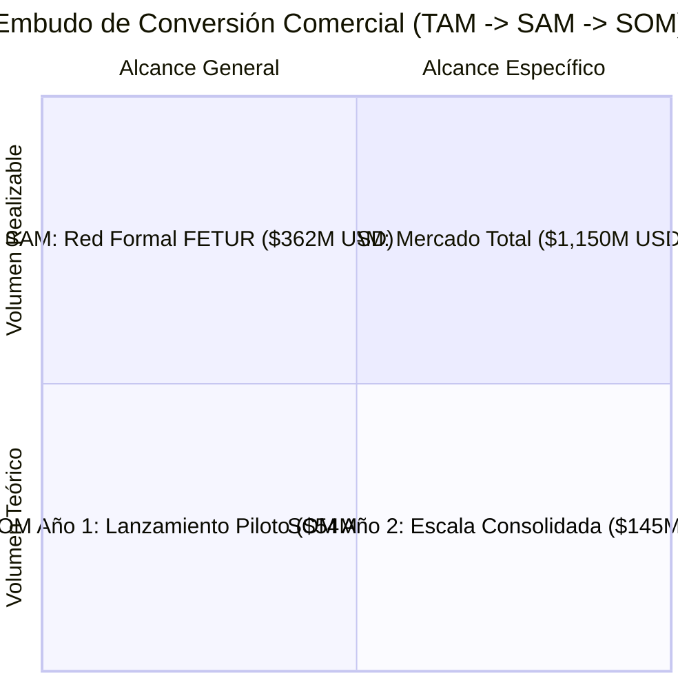

# MODELO FINANCIERO Y DESGLOSE TAM / SAM / SOM — APMs LATAM EN QUINTANA ROO

**Análisis de Penetración de Mercado y Proyección de Revenue**  
**Proyecto:** TPVs con APMs (PIX, Bre-B, Yape, Mercado Pago) para FETUR  
**Autor:** Antonio Gutiérrez  
**Fecha:** 7 de Agosto de 2026  

---

## 🎯 DEFINICIÓN DE CAPAS DE MERCADO (TAM, SAM, SOM)

---

## 📊 1. TAM (Total Addressable Market) — El Mercado Total Teórico

* **Concepto:** El 100% de la derrama económica en sitio desembolsada por turistas de Brasil, Colombia, Argentina y Perú en Quintana Roo.
* **Base de Cálculo:** 825,000 a 850,000 turistas anuales × $1,095 USD de gasto promedio en sitio.
* **Cifra TAM:** **$903.3M a $1,150.0M USD / año.**

---

## 🏦 2. SAM (Serviceable Addressable Market) — El Mercado Alcanzable por FETUR

* **Concepto:** El volumen de consumo que ocurre dentro de la red formal bancarizada de afiliados a FETUR y comercios turísticos equipados con TPVs (Hoteles, Parques, Restaurantes formales, Excursiones).
* **Filtros de Realidad:**
  1. **Descuento de Efectivo Informale:** El 30% del gasto en sitio se va en propinas en efectivo, vendedores ambulantes de playa y taxis no bancarizados. Nos queda el **70% en bancarizado formal**.
  2. **Cobertura de Red FETUR / Aliados:** Los afiliados de FETUR y la red turística objetivo representan el **45% del total bancarizado formal** del estado.
* **Fórmula SAM:** $\text{TAM} \times 70\% \text{ (Bancarizado)} \times 45\% \text{ (Cobertura FETUR)} = \mathbf{31.5\% \text{ del TAM}}$.
* **Cifra SAM:** **$284.5M a $362.25M USD / año.**

---

## 🚀 3. SOM (Serviceable Obtainable Market) — El Mercado Real Capturable (Año 1 y Año 2)

* **Concepto:** La adopción real esperada considerando la tasa de conversión del turista al ver el código QR del APM de su país en el mostrador.

### **Tasas de Conversión Estimadas por Nacionalidad (Al ver el QR en la TPV):**
* 🇧🇷 **Brasileños (PIX):** **70% de conversión** (Uso masivo cotidiano en Brasil).
* 🇦🇷 **Argentinos (Mercado Pago):** **55% de conversión** (Búsqueda de evitar recargos cambiarios).
* 🇵🇪 **Peruanos (Yape/Plin):** **50% de conversión** (Preferencia por débito/saldo directo).
* 🇨🇴 **Colombianos (Bre-B/Nequi):** **45% de conversión** (Adopción creciente de llaves Bre-B).

---

### 📈 PROYECCIÓN DE VOLUMEN SOM (AÑO 1 vs. AÑO 2):

| Métrica | Año 1 (Piloto & Ramp-Up) | Año 2 (Escala & Consolidación) |
| :--- | :--- | :--- |
| **Porcentaje de Captura del SAM** | **15% del SAM** | **40% del SAM** |
| **Comercios / Terminales Activas** | 150 – 250 TPVs en FETUR | 600 – 1,000 TPVs en FETUR |
| **Volumen Procesado (SOM)** | **$42.6M a $54.3M USD** | **$113.8M a $144.9M USD** |

---

## 💰 PROYECCIÓN DE INGRESOS (REVENUE MODELING)

Asumiendo una tarifa promedio de procesamiento transfronterizo del **2.0% Take Rate** (Spread FX + Fee PSP):

### **1. Ingresos Brutos para el Procesador (Motor PSP Aliado):**
* **Año 1:** $50.0M USD procesados × 2.0% = **$1,000,000 USD ($20M MXN) de Revenue Bruto**.
* **Año 2:** $130.0M USD procesados × 2.0% = **$2,600,000 USD ($52M MXN) de Revenue Bruto**.

### **2. Comisión / Revenue Share para Antonio (0.20% BPS de GMV):**
* **Año 1:** $50.0M USD procesados × 0.20% = **$100,000 USD ($2.0M Pesos MXN / año)**.
* **Año 2:** $130.0M USD procesados × 0.20% = **$260,000 USD ($5.2M Pesos MXN / año)**.

---

*Desglose financiero TAM, SAM y SOM formalizado y guardado en `riviera-maya-payments`.*
