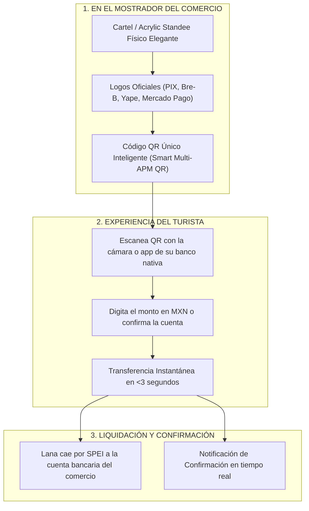

# EL CARTEL DE PAGO SUDAMERICANO: MODELO ZERO-DEVICE Y ZERO-ERP

**Estrategia de Producto de Máxima Simplicidad:** Standee QR Unificado Multi-APM para Mostrador y Mesa  
**Proyecto:** Pagos Turísticos LATAM (PIX, Bre-B, Yape, Mercado Pago)  
**Autor:** Antonio Gutiérrez — Concepto y Arquitectura de Producto  
**Fecha:** 7 de Agosto de 2026  

---

## 💡 EL CONCEPTO MAESTRO DE PRODUCTO DE ANTONIO

**Eliminar la dependencia de dispositivos (TPVs) y la complejidad de integraciones ERP.**

En Brasil, Colombia, Perú y Argentina, el **90% de los cobros en calle, restaurantes y comercios se realizan escaneando un cartel/standee de acrílico en el mostrador**. El turista sudamericano ya está 100% educado y acostumbrado a esta experiencia.



---

## 🎨 ANATOMÍA DEL "CARTEL DE PAGO SUDAMERICANO"

Un acrílico de alta calidad visual colocado en las cajas de restaurantes, recepciones de hoteles y barras de clubes de playa:

```
┌────────────────────────────────────────────────────────┐
│  🌐 PAGUE AQUÍ CON SU BANCO / BILLETERA NATIVA        │
│                                                        │
│   [LOGO PIX]  [LOGO BRE-B]  [LOGO YAPE]  [LOGO MP]     │
│   Brasil      Colombia      Perú         Argentina     │
│                                                        │
│                 ┌──────────────┐                       │
│                 │  ▄▄▄▄▄ ▄▄▄▄▄ │                       │
│                 │  █ ▄▄█ █▄▄ █ │                       │
│                 │  █▄▄▄█ ▄▄▄ █ │                       │
│                 │  ▄▄▄▄▄ █▄█▄▄ │                       │
│                 └──────────────┘                       │
│              Escanee para Pagar en MXN                 │
│                                                        │
│  ✨ Sin comisiones internacionales de tarjeta         │
│  🔒 Transacción Segura en Tiempo Real                 │
└────────────────────────────────────────────────────────┘
```

---

## 🏆 VENTAJAS COMPETITIVAS IMBATIBLES

1. **Cero Dependencia de Dispositivos (Zero Device):** No hay TPVs que cargar, no hay baterías que se agoten, no hay terminales que se rompan.
2. **Cero Desarrollo ERP:** No hay que solicitar permisos de TI ni hacer integraciones complejas con SAP, CONTPAQi o PMS.
3. **Cero Fricción de Adopción:** El comercio solo coloca el cartel en la caja. El turista ve los logos de su país y escanea de inmediato.
4. **Despliegue Ultrarrápido (Speed to Ship):** En lugar de meses de desarrollo, se pueden equipar **500 comercios de FETUR en menos de 48 horas** repartiendo la cartelería oficial.
5. **Cero Comisión a Fabricantes de Hardware:** El margen de ganancia para Motor PSP Aliado y Antonio se maximiza al no haber costos de terminales.

---

*Concepto de producto "Cartel de Pago Sudamericano Zero-Device" guardado en `riviera-maya-payments`.*
