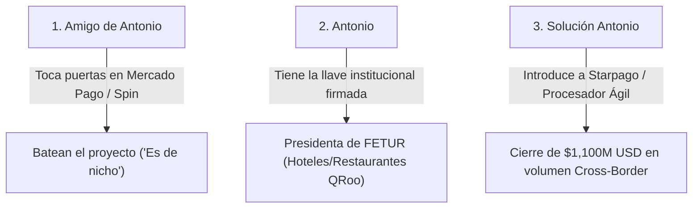

# DIAGNÓSTICO COMERCIAL: POR QUÉ LOS AGREGADORES TRADICIONALES RECHAZAN EL PROYECTO Y CÓMO STARPAGO GANA EL MERCADO ($1,100M USD)

**Análisis de Oportunidad de Nicho:** Mercado Pago / Spin vs. Starpago + FETUR  
**Autor:** Antonio Gutiérrez  
**Fecha:** 7 de Agosto de 2026  

---

## 🔍 EL DIAGNÓSTICO: ¿POR QUÉ MERCADO PAGO Y SPIN BATEAN EL PROYECTO?

1. **Enfoque en Volumen Masivo Doméstico (Low Margin):**
   * **Spin by OXXO** y **Mercado Pago México** están diseñados para el mercado masivo mexicano de bajo valor (recargas, depósitos en efectivo, compras en tiendas de conveniencia).
   * Para sus comités corporativos, integrar APMs transfronterizos (PIX, Bre-B, Yape) en TPVs requiere semanas de desarrollo e integración cambiaria (FX) que ellos ven como un **"proyecto de nicho"** fuera de su Core Business.

2. **La Paradoja del "Proyecto de Nicho":**
   * Lo que para un gigante corporativo como Mercado Pago o Spin es "demasiado trabajo para un nicho regional", para un procesador especializado ágil como **Starpago** representa un **mercado de $1,100 Millones de USD con comisiones transfronterizas del 1.5% al 3.0%**.

---

## 🎯 LA JUGADA COMERCIAL PERFECTA PARA ANTONIO Y SU AMIGO

### **1. Cómo destrabar la conversación con tu amigo:**

Tu amigo está atorado porque los agregadores tradicionales (Mercado Pago, Spin) no le hacen caso. Tú tienes la solución servida en bandeja de plata:

> *"Oye [Nombre de tu amigo], sé que Mercado Pago y Spin están viendo esto como un 'proyecto de nicho' porque ellos solo buscan volumen masivo de tienditas mexicanas y no le entienden al FX transfronterizo.*
>
> *Pero fíjate que estuve avanzando con la **Presidenta de FETUR** y la relación quedó cerradísima. Ellos están listos para arrancar con sus hoteles y restaurantes.*
>
> *En lugar de rogarle a Mercado Pago, yo tengo la puerta abierta con un **procesador de pagos transfronterizos (Starpago)** que está hecho a la medida para esto. Ellos SÍ entienden el margen cross-border, tienen las APIs ágiles y no nos van a frenar el proyecto.*
>
> *Si quieres, armemos la mesa entre tú, yo con FETUR y este procesador, aseguramos nuestro porcentaje de comisiones y lanzamos el piloto en la Riviera Maya."*

---

## 🚀 POR QUÉ ESTO TE POSICIONA COMO UN HÉROE DOBLE:

1. **Con tu Amigo:** Le resuelves el gran cuello de botella que lo tenía atorado (ningún agregador le aceptaba el proyecto) y le abres la puerta para empezar a monetizar.
2. **Con Starpago:** Les llevas un mercado de **$1,100M USD** libre de competencia (porque Mercado Pago y Spin lo dejaron ir) con la asociación comercial (FETUR) ya firmada.
3. **Con FETUR:** Te consolidas como el líder de tecnología que les trajo la solución real funcionando a sus mostradores.

*Estrategia de apertura de mercado registrada en `riviera-maya-payments`.*
