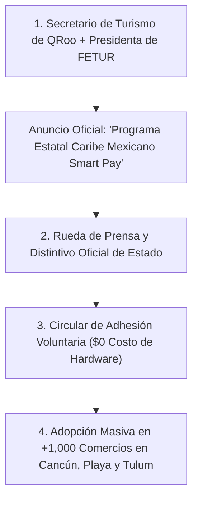

# ESTRATEGIA DE EMPUJE TOP-DOWN: SECRETARÍA DE TURISMO DE QUINTANA ROO (SECTUR QROO)

**Programa Oficial de Innovación y Penetración Comercial Masiva**  
**Proyecto:** Pagos Turísticos LATAM (PIX, Bre-B, Yape, Mercado Pago)  
**Vínculo:** Secretario de Turismo de Quintana Roo & Presidencia de FETUR  
**Autor:** Antonio Gutiérrez — Liderazgo de Innovación en Pagos Turísticos  
**Fecha:** 7 de Agosto de 2026  

---

## 🏛️ 1. LA ESTRATEGIA DEL RESPALDO INSTITUCIONAL (GOBIERNO + ASOCIACIÓN)

El apoyo del **Secretario de Turismo de Quintana Roo** cambia las reglas del juego: transforma una venta comercial privada en un **Programa Estatal de Innovación Turística de Alto Impacto**.

---

## 🏆 2. LOS 3 ENTREGABLES DEL PROGRAMA ESTATAL DE SECTUR QROO

### **1. Distintivo Oficial de Estado: "Caribe Mexicano Smart Pay"**
* SECTUR QRoo y FETUR otorgan un distintivo y sello digital de calidad e innovación a los comercios que aceptan APMs sudamericanos.
* Los hoteles y restaurantes exhiben el distintivo oficial en sus entradas y recepción, lo que genera **confianza absoluta en el turista extranjero**.

### **2. Lanzamiento en Rueda de Prensa de Estado**
* El Secretario de Turismo encabeza la rueda de prensa oficial de presentación del programa de digitalización de cobros sudamericanos ante medios locales e internacionales.
* Antonio participa como el **Director de la Comisión de Innovación Tecnológica de FETUR** presentando la infraestructura y los beneficios de derrama.

### **3. Circular de Inserción sin Resistencia Comercial**
* Cuando el dueño de un restaurante u hotel recibe la recomendación institucional firmada por la Secretaría de Turismo y FETUR, la resistencia comercial desaparece.
* Pasa de ser "un proveedor vendiendo TPVs" a un **"Programa de Estado para capturar más turismo y aumentar ventas en temporada baja"**.

---

## 🎯 EL RESULTADO DE PENETRACIÓN ACELERADA:

* **De 175 Comercios (Fase Piloto FETUR) a +1,000 Comercios (Escala Estatal)** en menos de 90 días.
* **Respaldo Institucional Total:** Nadie le cierra la puerta a un programa oficial avalado por la Secretaría de Turismo del Estado.

---

*Estrategia de empuje institucional SECTUR QRoo guardada en `riviera-maya-payments`.*
