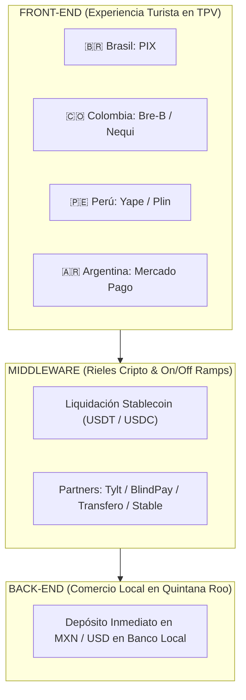

# ARQUITECTURA DE INFRAESTRUCTURA Y DATOS DE PROCESAMIENTO BANCOS CENTRALES x STABLECOINS

**Documento Estratégico para FETUR:** Integración de APMs Front-End (PIX, Bre-B, Yape, Mercado Pago) con Rieles de Liquidación Stablecoin (USDT/USDC)  
**Autor:** Antonio Gutiérrez — Estratega de Tecnología y Soluciones de Pago B2B  
**Fecha:** 7 de Agosto de 2026  

---

## 💎 EXECUTIVE SUMMARY: LA REVOLUCIÓN DE STABLECOINS EN LATAM

América Latina se ha consolidado como la **región número 1 a nivel mundial en adopción institucional de Stablecoins (USDC/USDT) para pagos transfronterizos**, con el **71% de las instituciones financieras** utilizando activos digitales para liquidación de tesorería y pagos internacionales.

---

## 🏛️ DATOS DUROS DE PROCESAMIENTO (BANCOS CENTRALES vs. STABLECOINS)

### **1. 🇧🇷 BRASIL — BANCO CENTRAL DO BRASIL (BCB) + CRYPTO**
* **Volumen PIX (BCB Oficial 2025):** **R$ 35.36 Trillones de Reales** (~$6.8 Trillones USD) movilizados en **79,800 millones de transacciones**.
* **Usuarios PIX:** **170.0 Millones de personas** (82% de la población del país).
* **Volumen Cripto/Stablecoins (2025):** **$319,000 Millones de USD** en volumen de transacciones cripto en Brasil.
* **Dominio Stablecoin:** **>90% del volumen cripto en Brasil** involucra Stablecoins (USDT/USDC) para liquidación comercial.

### **2. 🇨🇴 COLOMBIA — BANCO DE LA REPÚBLICA (BanRep) + STABLECOINS**
* **Sistema Bre-B (BanRep):** Sistema interoperable de pagos en tiempo real (<20 segundos) operando 24/7.
* **Ecosistema Billeteras:** **Nequi (18.0M usuarios)** y **Daviplata (16.0M usuarios)**.
* **Adopción Stablecoin:** Las Stablecoins representan **más del 50% de las transacciones Fiat-to-Crypto** en Colombia como cobertura ante la volatilidad cambiaria.
* **Infraestructura Destacada:** Partners como *Stable* operan los On/Off Ramps colombianos.

### **3. 🇵🇪 PERÚ — BANCO CENTRAL DE RESERVA DEL PERÚ (BCRP) + CREDICORP**
* **Yape (BCP):** **17.0 Millones de usuarios activos** y **>40 Millones de transacciones diarias**.
* **Volumen Mensual Yape:** **S/ 48,174 Millones de Soles** al mes.
* **Plin (Interbank/BBVA/Scotiabank):** >6.5 Millones de usuarios interoperables.

### **4. 🇦🇷 ARGENTINA — BANCO CENTRAL DE LA REPÚBLICA ARGENTINA (BCRA)**
* **Transferencias 3.0 & Mercado Pago:** **>25 Millones de usuarios activos**.
* **Adopción Stablecoin:** Argentina es el mercado #1 en adopción minorista de USDT en LATAM para protección de poder adquisitivo.

---

## ⚡ ¿DEBEMOS INCLUIR STABLECOINS EN LA PROPUESTA CON FETUR Y CÓMO VENDERLO?

### **LA RESPUESTA ESTRATÉGICA: SÍ, PERO CON EL ENFOQUE "INVISIBLE ENGINE"**

Para los empresarios turísticos de FETUR (hoteleros, restauranteros, operadores de tours), el término "Cripto" a menudo genera dudas regulatorias o de volatilidad. Por ello, la narrativa estratégica debe estructurarse en **3 capas invisibles**:

| Capa | Actor | Experiencia de Usuario | Tecnología subyacente |
| :--- | :--- | :--- | :--- |
| **Front-End** | **Turista Sudamericano** | 100% Fiat Nativa (Escanea QR con su app de banco: PIX, Bre-B, Yape) | APMs locales |
| **Middleware** | **Procesador / TPV** | Conversión instantánea a segundos | **Stablecoins (USDT/USDC) vía Tylt / BlindPay / Transfero** |
| **Back-End** | **Hotel / Comercio FETUR** | 100% Fiat Tradicional (Recibe MXN/USD en su cuenta de banco en México) | Sistema Financiero Mexicano (SPEI) |

---

## 🎯 LOS 4 BENEFICIOS QUE CONVENCEN A FETUR DE USAR RIELES STABLECOIN (USDC/USDT):

1. **Cero Volatilidad (Sustitución de Dólar Físico):** Al usar Stablecoins como riel intermedio, el tipo de cambio se congela en el milisegundo de la transacción. El comercio no toca Bitcoin ni activos volátiles.
2. **Liquidación Instantánea (Bye Bye SWIFT):** En lugar de esperar 3 a 5 días hábiles a que una transferencia bancaria internacional bancaria libere los fondos, el riel Stablecoin liquida los Pesos Mexicanos al comercio en **menos de 30 segundos**.
3. **Cero Comisiones Bancarias Intermediarias:** Elimina las comisiones de bancos corresponsales internacionales (que cobran entre $25 y $50 USD por giro bancario).
4. **Respaldo Tecnológico de Clase Mundial:** Respaldado por el ecosistema de infraestructura latinoamericano (*Tylt, BlindPay, Transfero, Parfin, Stable*).

---

*Estudio de infraestructura Cripto/APM registrado y guardado en el repositorio `riviera-maya-payments`.*
