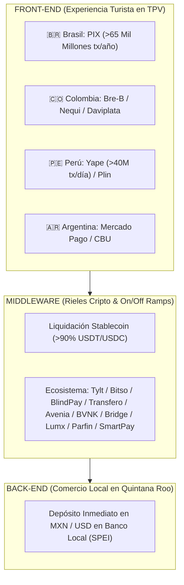

# ARQUITECTURA DE INFRAESTRUCTURA Y DATOS DE PROCESAMIENTO BANCOS CENTRALES x STABLECOINS

**Documento Estratégico para FETUR:** Integración de APMs Front-End (PIX, Bre-B, Yape, Mercado Pago) con Rieles de Liquidación Stablecoin (USDT/USDC)  
**Autor:** Antonio Gutiérrez — Estratega de Tecnología y Soluciones de Pago B2B  
**Fecha:** 7 de Agosto de 2026  

---

## 💎 EXECUTIVE SUMMARY: LA REVOLUCIÓN DE STABLECOINS EN LATAM

América Latina se ha consolidado como la **región número 1 a nivel mundial en adopción institucional de Stablecoins (USDC/USDT) para pagos transfronterizos**, con el **71% de las instituciones financieras** utilizando activos digitales para liquidación de tesorería y pagos internacionales.

---

## 🏛️ DATOS DUROS OFICIALES DE PROCESAMIENTO Y STABLECOINS (2025-2026)

### **1. 🇧🇷 BRASIL — EL LÍDER GLOBAL INDISCUTIBLE**
* **Volumen PIX:** **Más de 65,000 millones de transacciones procesadas en 2025**, consolidando la red de pago en tiempo real más grande y eficiente del mundo occidental.
* **Volumen Cripto Total (2025):** **$319,000 Millones de USD** procesados en Brasil (el nivel más alto de América Latina).
* **Predominio de Stablecoins:** **Más del 90% del volumen cripto en Brasil involucra Stablecoins (USDT/USDC)**, convirtiéndolas en el activo digital dominante para pagos cotidianos, liquidación comercial y tesorería transfronteriza.
* **Ecosistema de Infraestructura:** Jugadores clave como *Avenia, Transfero, Lumx, Parfin, Liqi Digital Assets, Tylt, SmartPay LATAM, Bitso, BVNK, Bridge y Hodle* están construyendo las capas de emisión, tokenización, tesorería y ramps local/cripto.

### **2. 🇨🇴 COLOMBIA — ADOPCIÓN FIAT-TO-CRYPTO**
* **Sistema Bre-B (BanRep):** Red de transferencias en tiempo real (<20 segundos) operando 24/7.
* **Billeteras Masivas:** **Nequi (18.0M usuarios)** y **Daviplata (16.0M usuarios)**.
* **Stablecoins:** Las Stablecoins representan **más del 50% de las compras Fiat-to-Crypto** en Colombia, impulsadas por la demanda de pagos transfronterizos rápidos y acceso a activos denominados en USD.
* **Infraestructura Destacada:** *Stable* y *Koywe* (Chile/Andino).

### **3. 🇵🇪 PERÚ — YAPE & CREDICORP**
* **Yape (BCP):** **17.0 Millones de usuarios activos** y **>40 Millones de transacciones diarias**.
* **Volumen Mensual Yape:** **S/ 48,174 Millones de Soles** al mes.
* **Plin:** >6.5 Millones de usuarios interoperables.

### **4. 🇦🇷 ARGENTINA — MERCADO PAGO & COBERTURA USD**
* **Mercado Pago / Transferencias 3.0:** **>25 Millones de usuarios**.
* **Stablecoins:** >50% de compras fiat-to-crypto destinadas a Stablecoins (USDT/USDC) como medio de protección y pago.

---

## 🌎 ANÁLISIS: ¿POR QUÉ BRASIL SERÁ EL LÍDER GLOBAL DE PAGOS CON STABLECOINS EN LOS PRÓXIMOS 5 AÑOS?

Brasil está **únicamente posicionado para ser el líder mundial absoluto** en pagos impulsados por Stablecoins debido a la convergencia de 3 factores estructurales irrepetibles:

1. **La Red PIX como "Rampa de Lanzamiento" Instantánea:** Ningún país occidental posee una infraestructura de pagos en tiempo real con 170M de usuarios y 65B de transacciones anuales. Al conectar PIX directamente con Stablecoins (PIX ↔ USDT/USDC), la fricción de entrada y salida (*On/Off Ramp*) desaparece a nivel nacional.
2. **Claridad Regulatoria y Proyecto Drex (BCB):** El Banco Central do Brasil no prohibió la tecnología; al contrario, reguló a los VASP/DASP y está creando *Drex* (el Real Digital Tokenizado), lo que da certidumbre jurídica a instituciones financieras para mover billones en rampa cripto.
3. **Masa Crítica de Infraestructura:** El ecosistema de startups como *Tylt, Transfero, Bitso, BlindPay, BVNK, Avenia y Parfin* ha resuelto cada capa de la pila (tesorería, comercios, liquidación cross-border y APIs b2b).

---

## ⚡ ¿CÓMO PRESENTAR ESTA TECNOLOGÍA EN LA PROPUESTA CON FETUR?

### **LA NARRATIVA "CERO FRICCIÓN / INVISIBLE ENGINE"**

Para los empresarios de FETUR, la propuesta no se vende como "criptomonedas" (que genera temor a volatilidad o temas fiscales), sino como **"Rieles de Tecnológicos de Liquidación Instantánea (Instant Settlement Rails)"**:

| Capa de Experiencia | ¿Qué ve el Usuario / Comercio? | Tecnología de Infraestructura |
| :--- | :--- | :--- |
| **Turista Sudamericano** | Paga escaneando un QR con su app bancaria nativa (**PIX, Bre-B, Yape, Mercado Pago**). | APM Local Nativo |
| **Middleware de Proceso** | El pago se convierte en milisegundos y viaja por rieles de **Stablecoins (USDC/USDT)** sin pasar por bancos corresponsales lentos. | **Tylt / Bitso / Transfero / BlindPay Stack** |
| **Comercio FETUR en QRoo** | Recibe **Pesos Mexicanos (MXN) o Dólares (USD)** de inmediato en su cuenta de banco local vía SPEI. | Liquidación Fiat Garantizada |

---

## 🎯 LOS 4 BENEFICIOS COMERCIALES CLAVE PARA FETUR:

1. **Zero Volatilidad:** El tipo de cambio se fija en el milisegundo exacto de la transacción. El hotelero o restaurantero recibe exacto su precio en MXN/USD.
2. **Liquidación en Segundos (vs. 3-5 días SWIFT):** Se eliminan las esperas de transferencias internacionales bancarias.
3. **Cero Comisiones de Banco Corresponsal:** Se eliminan los cobros de $25-$50 USD por giro transfronterizo tradicional.
4. **Protección Total contra Contracargos:** Al ser liquidado mediante transferencias de bloque e instantáneas, los cobros son **irreversibles y 100% seguros** para el negocio.

---

*Estudio de datos oficiales de Bancos Centrales y Rieles de Stablecoin actualizado y registrado en el repositorio `riviera-maya-payments`.*
