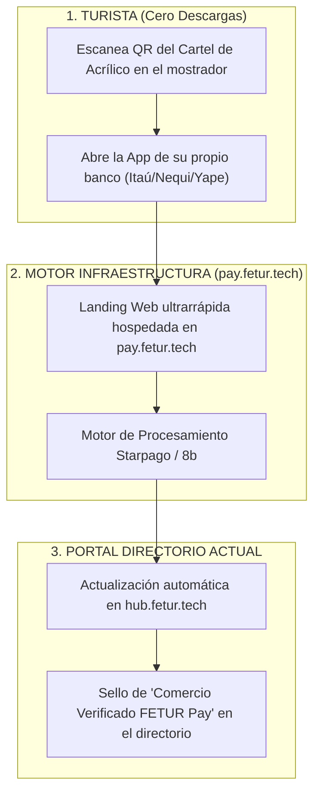

# ESTRATEGIA DE INFRAESTRUCTURA WEB NO-CODE / WEB-LANDING (SITIANDO HUB.FETUR.TECH)

**Modelo Zero-App:** Integración Ligera sobre el Portal Actual de FETUR (`hub.fetur.tech`)  
**Proyecto:** Pagos Turísticos LATAM (PIX, Bre-B, Yape, Mercado Pago)  
**Autor:** Antonio Gutiérrez — Estratega de Tecnología y Soluciones de Pago B2B  
**Fecha:** 7 de Agosto de 2026  

---

## 🎯 EL DIAGNÓSTICO DE LA SITUACIÓN ACTUAL DE FETUR

1. **Estado Actual:** FETUR no cuenta con una App nativa. Tienen un portal directorio en **Lovable** (`https://hub.fetur.tech/categoria/hoteleria`).
2. **Contexto Político:** El Secretario de Gobernación es miembro/aliado, pero buscar presupuestos gubernamentales o licitaciones públicas para desarrollar una App estatal tarda **de 12 a 24 meses de burocracia política**.
3. **Comportamiento del Turista:** Ningún turista extranjero va a descargar una App local de Quintana Roo solo para pagar un almuerzo o un tour de un día.

---

## 🚀 LA SOLUCIÓN MAESTRA: MODELO ZERO-APP (WEB-NATIVE PAY)

**¡NO SE NECESITA DESARROLLAR NINGUNA APP NATIVA PARA FETUR!**

---

## 💡 CÓMO MONTAREMOS LA PASARELA SOBRE SU ECOSISTEMA EN 48 HORAS

### **1. Subdominio Oficial: `pay.fetur.tech`**
* En lugar de construir software desde cero, se apunta el subdominio `pay.fetur.tech` hacia el motor de redirección de Starpago.
* Cuando el turista escanea el cartel del comercio, la URL que ve en su navegador es oficial: `https://pay.fetur.tech/qr/HOTEL-01`. Esto le da **confianza institucional 100% legítima**.

### **2. Integración al Directorio Lovable (`hub.fetur.tech`)**
* Los hoteles y restaurantes listados en `hub.fetur.tech/categoria/hoteleria` reciben un **Badge / Distintivo Oficial**:
  * 🟢 **"Comercio Afiliado — Acepta Pagos Sudamericanos (PIX/Bre-B/Yape)"**.
* Al hacer clic en la ficha del hotel o restaurante dentro de `hub.fetur.tech`, el portal incluye el botón de pago previo o reservas directas.

---

## 💬 EL PITCH DE IMPACTO PARA LA PRESIDENTA DE FETUR Y GOBERNACIÓN

> *"Presidenta, no necesitamos presupuestos gubernamentales ni meses de licitación para desarrollar Apps que los turistas jamás van a descargar.*
>
> *Le montamos la pasarela de pagos `pay.fetur.tech` conectada directamente a su portal actual (`hub.fetur.tech`) en menos de una semana. Entregamos la cartelería física a los afiliados y FETUR se presenta ante la Secretaría de Gobernación y el Gobierno del Estado como la primera asociación en digitalizar el turismo receptivo sudamericano **con costo cero de inversión en software para la asociación**."*

---

*Estrategia de integración web sin Apps nativas guardada en `riviera-maya-payments`.*
