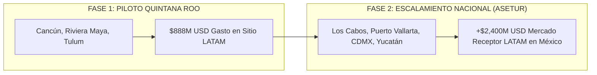

# ESTRATEGIA DE ESCALAMIENTO NACIONAL (ASETUR & PILOTO QUINTANA ROO)

**Marco de Crecimiento Federal:** De Quintana Roo a los Principales Polos Turísticos de México  
**Vínculo Institucional:** Unión de Secretarios de Turismo de México (ASETUR) & FETUR  
**Autor:** Antonio Gutiérrez — Liderazgo de Innovación en Pagos Turísticos  
**Fecha:** 7 de Agosto de 2026  

---

## 🏛️ 1. EL ALCANCE NACIONAL DEL VÍNCULO INSTITUCIONAL

Al contar con el apoyo del **Secretario de Turismo de Quintana Roo**, quien a su vez es **Consejero Nacional de ASETUR (Unión de Secretarios de Turismo de México)**:

* **Fase 1 (Piloto Quintana Roo):** Se establece Quintana Roo (Cancún, Riviera Maya, Tulum, Cozumel) como el **Caso de Éxito Nacional Piloto** con los comercios afiliados a FETUR.
* **Fase 2 (Escalamiento Federal ASETUR):** La infraestructura de cobro por APMs sudamericanos se presenta en la **Asamblea Nacional de ASETUR** para replicarse en los principales destinos turísticos receptivos de México:
  1. **Los Cabos** (Baja California Sur)
  2. **Puerto Vallarta / Riviera Nayarit** (Jalisco / Nayarit)
  3. **Ciudad de México (CDMX)** (Turismo urbano y de negocios)
  4. **Yucatán & Oaxaca** (Turismo cultural y gastronómico)

---

## 📈 POTENCIAL DE MERCADO ESCALADO A NIVEL NACIONAL

### **Mercado Receptor LATAM Total México:**
* **Viajeros Sudamericanos Anuales a México:** Más de **1.8 Millones de turistas** a nivel nacional.
* **Derrama Total en Sitio Nacional:** **+$2,400 Millones de Dólares al año**.

---

## 💬 EL PITCH DE NIVEL CONSEJO NACIONAL (ASETUR)

> *"Secretario: Con Quintana Roo como la punta de lanza y el primer caso de éxito probado en FETUR, esta infraestructura coloca al estado como el líder indiscutible en tecnología turística en México.*
>
> *Posteriormente, a través del **Consejo Nacional de ASETUR**, podemos llevar esta misma solución a Los Cabos, Puerto Vallarta y la CDMX, convirtiendo a México en el primer país de América Latina en tener sus polos turísticos 100% interoperables con los sistemas de pago de Brasil, Colombia, Perú y Argentina."*

---

*Estrategia de escalamiento nacional ASETUR registrada en `riviera-maya-payments`.*
