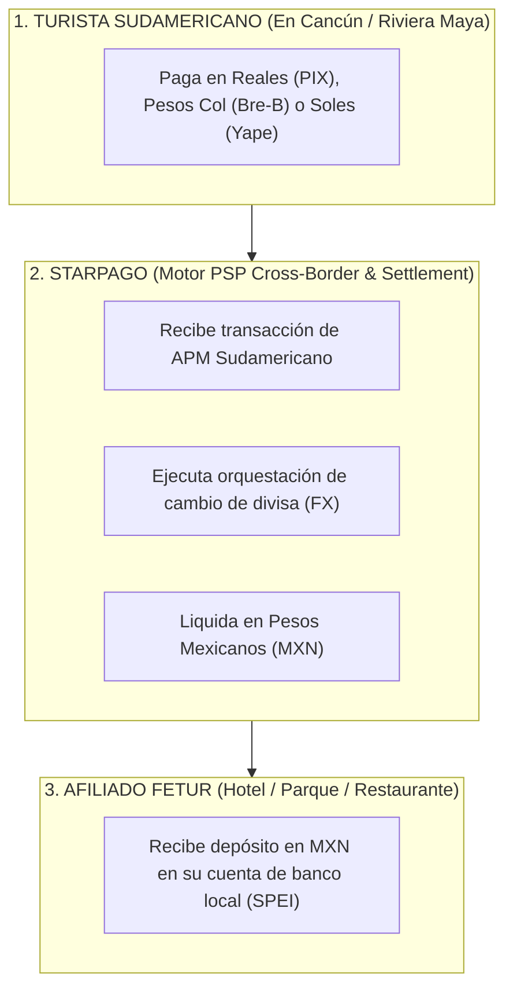

# ANÁLISIS ESTRATÉGICO: STARPAGO vs 8b — PROYECTO TURISMO RECEPTIVO LATAM (FETUR)

**Documento de Evaluación y Pitch de Carrera:** Oportunidad de Posicionamiento Comercial Starpago  
**Autor:** Antonio Gutiérrez  
**Fecha:** 7 de Agosto de 2026  

---

## 💡 EXECUTIVE SUMMARY

Starpago **SÍ PUEDE SUPLIR A 8b** y actuar como la plataforma de procesamiento transfronterizo (Cross-Border PSP / Settlement Rail) para el proyecto de cobros turísticos con APMs sudamericanos (PIX, Bre-B, Yape, Mercado Pago) en Quintana Roo.

Actualmente, Starpago concentra su esfuerzo comercial en la vertical de **High Risk** (Gaming, iGaming, Forex, Productos Digitales) porque busca altos márgenes transfronterizos. Sin embargo, el **Turismo Receptivo Internacional (LATAM → México)** representa una oportunidad de negocio superior: **márgenes similares a High Risk, pero con CERO RIESGO DE CONTRACARGO y volumen institucional garantizado por FETUR.**

---

## 📊 COMPARATIVA DE ARQUITECTURA: STARPAGO vs. 8b

| Criterio | 8b | Starpago | Ventaja Estratégica para Antonio |
| :--- | :--- | :--- | :--- |
| **Rol en el Proyecto** | Proveedor de rieles transfronterizos externo. | Procesador / PSP de Pago Transfronterizo directo. | **Control total del producto y revenue en tu nuevo empleo.** |
| **Integración con APMs (PIX, Bre-B, Yape)** | Integrado externamente. | Capacidad de orquestación Cross-Border nativa o vía partners API. | Starpago puede habilitar ruteo directo hacia TPVs en México. |
| **Riesgo Operativo** | Enfocado en e-commerce transfronterizo. | Concentrado en *High Risk* (alto riesgo regulatorios/contracargos). | **Diversifica la cartera de Starpago hacia una vertical "Low Risk / High Margin".** |
| **Acceso Comercial en Quintana Roo** | Depende de fuerza de ventas de terceros. | Traído directamente por Antonio vía **Alianza Alianza FETUR**. | **Llegas a Starpago con el cliente institucional firmado (FETUR).** |

---

## 🎯 ¿POR QUÉ ESTO ES UN "GAME-CHANGER" PARA TU ENTREVISTA EN STARPAGO?

Si en tu entrevista con la dirección de Starpago les presentas este proyecto, tu estatus cambia de **"Candidato a vacante"** a **"Director Comercial con Portafolio de Negocio de $1,100M USD"**.

### **El Pitch Comercial para la Dirección de Starpago:**

> *"Sé que hoy la estrategia de Starpago está fuertemente volcada a High Risk porque ahí están los márgenes del procesador cross-border. Sin embargo, el High Risk sufre de contracargos, bloqueo de cuentas y volatilidad regulatoria.*
>
> *Tengo abierta y alineada la relación institucional con la **Federación de Empresarios Turísticos de México (FETUR)** en Quintana Roo para abrir la vertical de **Turismo Receptivo LATAM (PIX, Bre-B, Yape)**.*
>
> *Estamos hablando de capturar un mercado de **más de 1 Millón de turistas al año** que gastan **$1,150M USD en sitio**. Como los APMs sudamericanos son transferencias instantáneas, **el riesgo de contracargo para Starpago es CERO (irreversible)**, pero el margen de conversión de divisas (FX) y procesamiento transfronterizo es **tan rentable como el High Risk**. Podríamos usar a Starpago como el motor PSP detrás de FETUR."*

---

## 🏗️ ARQUITECTURA OPERATIVA: CON STARPAGO COMO PROCESADOR

---

## 🚀 PASOS SUGERIDOS PARA APROVECHAR AMBOS FRENTES

1. **Con FETUR (Lado Cliente):** Sigues formalizando tu rol como *Líder del Comité de Innovación en Pagos*. Esto te da la bandera institucional.
2. **Con Starpago (Lado Empleador):** Les vendes la visión de que tú traes la vertical de Turismo Receptivo LATAM lista para montarse sobre su infraestructura de pago, sacándolos de la dependencia exclusiva del *High Risk*.

*Análisis estratégico de carrera y arquitectura de negocio guardado en `riviera-maya-payments`.*
