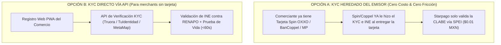

# ARQUITECTURA OPERATIVA Y COSTOS DE VERIFICACIÓN KYC

**¿Quién ejecuta el KYC y quién paga la verificación?**  
**Proyecto:** Pagos Turísticos LATAM (PIX, Bre-B, Yape, Mercado Pago)  
**Autor:** Antonio Gutiérrez — Estratega de Tecnología y Soluciones de Pago B2B  
**Fecha:** 7 de Agosto de 2026  

---

## 🔍 1. ¿QUIÉN EJECUTA EL ONBOARDING Y VERIFICACIÓN KYC?

Existen 2 modelos de ejecución operativa:

### **A. Opción Recomendada (KYC Heredado de Spin / Emisores):**
* **La Jugada Maestra:** Si el lanchero o artesano ya posee una tarjeta **Spin by OXXO, BanCoppel o Mercado Pago**, **Spin o Coppel YA realizaron la verificación oficial de INE y biometría** al abrirle la cuenta.
* **El Flujo:** El comercio solo ingresa su número celular + su CLABE Interbancaria de Spin. La plataforma de Starpago únicamente realiza un envío de validación por SPEI de $0.01 MXN para certificar la titularidad.
* **Resultado:** **Cero costo de verificación y cero burocracia.**

### **B. Opción Secundaria (KYC Directo por API):**
* Si el comerciante es 100% nuevo y no tiene cuenta previa, se dispara la API de verificación de identidad (**Truora, TuIdentidad o MetaMap**) para validar el INE contra el padrón de RENAPO.

---

## 💰 2. ¿QUIÉN PAGA EL COSTO DE LA VERIFICACIÓN KYC?

El costo de una verificación KYC biométrica + INE en México oscila entre **$8.00 y $18.00 Pesos MXN ($0.40 a $0.90 USD)** por merchant único.

### **3 Esquemas de Absorción del Costo (Zero Cost para el Comercio):**

| Modelo | ¿Quién Paga? | Mecanismo de Absorción |
| :--- | :--- | :--- |
| **Modelo 1: CAC del Procesador (Starpago)** | **Starpago Engine** | Se absorbe como Costo de Adquisición de Cliente (CAC). Se recupera en la **primera transacción del turista** (con un cobro de $85 USD, la comisión cubre los $15 MXN del KYC). |
| **Modelo 2: Subsidio del Emisor (Spin by OXXO)** | **Spin by OXXO** | Si el comerciante abre su cuenta Spin a través del programa, **Spin paga el 100% del KYC** porque gana un usuario activo nuevo. |
| **Modelo 3: Fondo de Innovación Turística SECTUR** | **SECTUR QRoo / FETUR** | Se financia dentro del Kit Oficial del programa estatal *Caribe Mexicano Smart Pay*. |

---

## 🎯 RESUMEN EJECUTIVO COMERCIAL:

> *"Para el 80% de los comerciantes que ya usan tarjetas como Spin OXXO, BanCoppel o Mercado Pago, **el costo de KYC es $0** porque aprovechamos la verificación que su banco ya realizó.*
>
> *Para el 20% restante que requiere verificación biométrica directa, el costo de **$12 Pesos MXN** es absorbido por **Starpago como costo de adquisición (CAC)** y se amortiza en el primer cobro del turista."*

---

*Arquitectura de costos de KYC guardada en `riviera-maya-payments`.*
