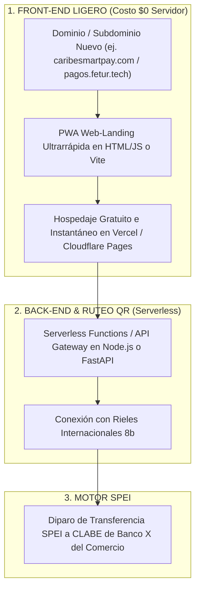

# HOJA DE RUTA: CONSTRUCCIÓN DE INFRAESTRUCTURA WEB DESDE CERO (GROUND ZERO INFRASTRUCTURE)

**Plan de Despliegue Técnico Sin Infraestructura Previa**  
**Proyecto:** Pagos Turísticos LATAM (PIX, Bre-B, Yape, Mercado Pago)  
**Autor:** Antonio Gutiérrez — Estratega de Tecnología y Soluciones de Pago B2B  
**Fecha:** 7 de Agosto de 2026  

---

## 📌 1. LA REALIDAD DE INFRAESTRUCTURA ACTUAL

Actualmente:
* **NO existe un sitio web ni infraestructura de servidores** creada para este proyecto.
* **NO hay sistemas de software previos ni APIs desarrolladas**.
* Todo debe ser diseñado y construido **desde cero (Ground Zero)** de forma ligera, económica y ultrarrápida (Speed to Ship).

---

## 🏗️ 2. LA ARQUITECTURA WEB LIGERA DESDE CERO (STACK DE 48 HORAS)

Para construir la infraestructura sin gastar presupuestos ni semanas de desarrollo:

---

## 🚀 3. FASES DE CONSTRUCCIÓN ESTRUCTURADA

### **Fase 0: Estado Actual (Hoy)**
* Cero infraestructura web creada. Levantamiento de requerimientos y diseño de producto.

### **Fase 1: Configuración de Infraestructura Básica (Días 1 a 3)**
1. **Registro de Dominio / Subdominio:** Comprar dominio neutro o subdominio institucional (ej. `caribesmartpay.com`).
2. **Despliegue de Web-Landing de Cobro:** Crear el sitio PWA donde aterriza el turista al escanear el QR.
3. **Módulo de Registro Express:** Formularios de 3 campos para que los comerciantes registren su nombre, INE y CLABE de Banco X.

### **Fase 2: Conexión con Rieles 8b y SPEI (Días 4 a 7)**
1. **Integración API de 8b:** Conectar las claves API de 8b para la recepción de PIX, Bre-B, Yape y conversión cambiaria FX.
2. **Prueba de Depósito SPEI:** Ejecución de pruebas de envío automático de SPEI a cuentas de BanCoppel, Spin OXXO y BBVA.

### **Fase 3: Impresión de Carteles Físicos (Días 8 a 12)**
1. **Generación de QRs Únicos:** Generar los códigos QR con las URLs de la nueva infraestructura.
2. **Impresión de Carteles de Acrílico y Gafetes:** Producir el primer lote de 175 carteles/gafetes para los comercios de FETUR.

---

## 🎯 RESUMEN EJECUTIVO:

> *"Partimos desde cero de forma inteligente: no necesitamos meses de ingeniería ni servidores costosos. En menos de 72 horas montamos la Web-Landing PWA en Vercel/Cloudflare con costo $0 de servidor, la conectamos con los rieles de 8b e imprimimos la cartelería física para arrancar el piloto."*

---

*Plan de construcción de infraestructura desde cero guardado en `riviera-maya-payments`.*
