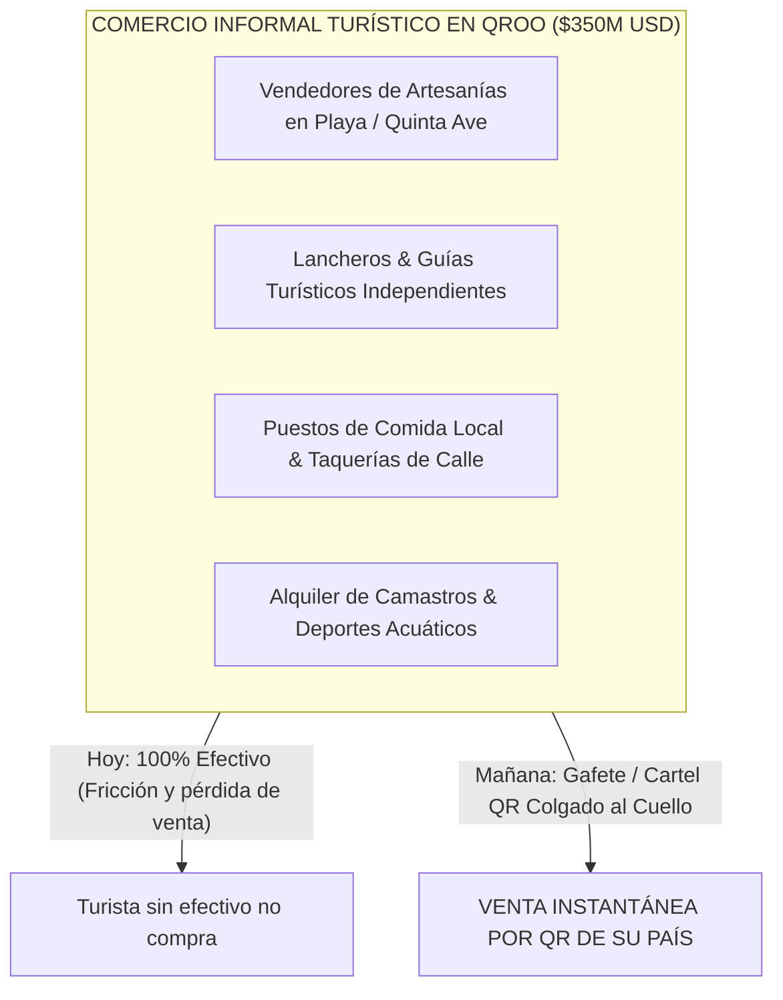

# EL FACTOR COMERCIO INFORMAL: LA INCLUSIÓN DE MICRO-PYMES TURÍSTICAS VÍA QR

**La Oportunidad Oculta de $350M USD No Contabilizada en el Mercado Tradicional**  
**Inspiración del Modelo:** Casos de Éxito de PIX (Brasil), Yape (Perú) y Nequi (Colombia)  
**Proyecto:** Pagos Turísticos LATAM (PIX, Bre-B, Yape, Mercado Pago)  
**Autor:** Antonio Gutiérrez — Estratega de Tecnología y Soluciones de Pago B2B  
**Fecha:** 7 de Agosto de 2026  

---

## 💡 LA REVELACIÓN DE LA PRESIDENTA DE FETUR

En Brasil, Colombia y Perú, las tecnologías de cobro instantáneo (PIX, Nequi, Yape) **NO nacieron en los grandes corporativos, sino en la economía informal y micro-comercial**:
* En Copacabana (Río de Janeiro), el vendedor de agua de coco en la playa cobra con un QR de PIX colgado al cuello.
* En Lima, el mototaxista y el puestero de artesanías cobran con su QR de Yape.
* En Medellín, el vendedor de empanadas cobra con QR de Nequi.

---

## 🏖️ LA ECONOMÍA INFORMAL TURÍSTICA EN QUINTANA ROO

En la franja turística de Quintana Roo (Cancún, Playa del Carmen, Tulum, Cozumel, Holbox), existe una capa masiva de micro-comerciantes turísticos que **hoy solo cobran en efectivo**:

### **El Mercado No Contabilizado:**
* El **30% al 35% del gasto en sitio de los turistas** se desembolsa en efectivo en el sector micro-comercial informal.
* Representa un mercado oculto de **+$350 Millones de Dólares al año en Quintana Roo** que el sistema bancario tradicional (TPVs) ignora por completo.

---

## 📲 LA SOLUCIÓN: GAFETES Y CARTELERÍA QR DE CUELLO (ZERO-HARDWARE)

Para estos micro-comerciantes informales:
1. **No necesitan TPV física ni rentas.**
2. Se les entrega un **Gafete / Credencial Rígida colgada al cuello o Cartel LAMINADO de Carrito** con el **Smart Multi-APM QR**.
3. El turista brasileño, colombiano o peruano ve los logos de su país en el gafete del vendedor, escanea el QR en 3 segundos y realiza la transferencia.

---

## 🎯 IMPACTO SOCIAL Y POLÍTICO PARA LA PRESIDENTA DE FETUR Y SECTUR:

> *"Presidenta: Esta es la verdadera inclusión financiera turística. No solo bancarizamos a los grandes hoteles; le llevamos el cobro por QR de Brasil y Colombia al lanchero de Cozumel, al artesano de Playa del Carmen y al guía de Tulum. Les permitimos venderle al turista sudamericano sin necesidad de tarjeta de plástico ni terminales costosas."*

---

*Estudio de inclusión de comercio informal turístico guardado en `riviera-maya-payments`.*
