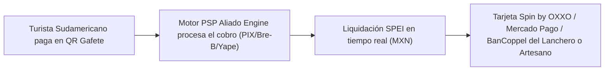

# MODELO DE ALIANZA CON EMISORES: SPIN BY OXXO COMO CUENTA DESTINO DE LIQUIDACIÓN

**Reorientación Estratégica de Alianza Comercial con Emisores de Tarjetas**  
**Proyecto:** Pagos Turísticos LATAM (PIX, Bre-B, Yape, Mercado Pago)  
**Autor:** Antonio Gutiérrez — Estratega de Tecnología y Soluciones de Pago B2B  
**Fecha:** 7 de Agosto de 2026  

---

## 💡 EL CAMBIO MAESTRO DE PARADIGMA: SPIN EN SU "CORE BUSINESS"

Fernando intentaba convencer a Spin (OXXO) de actuar como adquirente transfronterizo complejo (lo cual Spin batea por burocracia).

**La Jugada de Antonio es 10,000 veces más inteligente:**
Spin NO entra como adquirente transfronterizo. **Spin entra como la Cuenta Destino de Liquidación (Payout Wallet) oficial para el comerciante informal.**

---

## 🤝 POR QUÉ A SPIN (FEMSA / OXXO) LE FASCINA ESTE MODELO:

1. **Captura Masiva de Cuentahabientes (Float):** Spin gana miles de nuevos usuarios activos en Quintana Roo que reciben depósitos diarios en Pesos MXN.
2. **Circuito Cerrado OXXO:** El lanchero o artesano acude a los miles de tiendas OXXO en Cancún, Playa del Carmen y Tulum a retirar su efectivo o a realizar sus compras diarias con su tarjeta Spin.
3. **CERO Desarrollo Técnico para Spin:** Spin no tiene que programar ninguna API transfronteriza ni lidiar con bancos centrales de Sudamérica. Solo recibe depósitos SPEI normales en MXN a las CLABEs de sus usuarios.

---

## 💳 ECOSISTEMA ABIERTO DE EMISORES DE TARJETAS (PAYOUT ECOSYSTEM)

El comerciante informal puede asociar cualquier tarjeta de emisión rápida para recibir sus ventas:

| Emisor de Tarjeta | Perfil del Comerciante Informal | Beneficio de Liquidación |
| :--- | :--- | :--- |
| 🔴 **Spin by OXXO** | Artesanos, lancheros y vendedores ambulantes | Retiro de efectivo inmediato en cualquier tienda OXXO de QRoo. |
| 💛 **BanCoppel / Saldazo** | Puestos de comida callejera y taquerías | Presencia masiva de sucursales Coppel para trámites. |
| 💙 **Mercado Pago México** | Taxistas, guías turísticos e independientes | Disposición de dinero en app digital e inversiones en cuenta. |
| 🖤 **Klar / Stori / Nu México** | Micro-empresarios jóvenes y boutique | Tarjetas de débito/crédito sin comisiones de manejo. |

---

## 🎯 EL PITCH REFORMULADO PARA PRESENTAR A SPIN (OXXO):

> *"Estimado equipo de Spin: No les venimos a pedir que desarrollen un sistema adquirente transfronterizo complejo.*
>
> *Les traemos un programa en Quintana Roo respaldado por FETUR y la Secretaría de Turismo para bancarizar a miles de lancheros, artesanos y guías turísticos. Nosotros procesamos el cobro transfronterizo con los turistas y **les depositamos a todos ellos directamente en sus tarjetas Spin by OXXO**.*
>
> *Ustedes ganan miles de usuarios nuevos, depósitos diarios en MXN y flujo de caja en sus tiendas OXXO sin invertir un solo peso en desarrollo de software."*

---

*Estrategia de alianza con emisores (Spin OXXO) guardada en `riviera-maya-payments`.*
