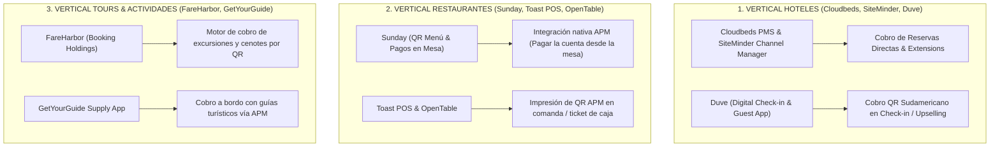

# MAPA DE ALIANZAS Y ECOSISTEMA TECNOLÓGICO DE FETUR (`hub.fetur.tech`)

**Estrategia de Integración Directa con la Secretaría de Turismo de Quintana Roo y Software Aliado**  
**Proyecto:** Pagos Turísticos LATAM (PIX, Bre-B, Yape, Mercado Pago)  
**Autor:** Antonio Gutiérrez — Estratega de Tecnología y Soluciones de Pago B2B  
**Fecha:** 7 de Agosto de 2026  

---

## 🏛️ 1. CONTEXTO INSTITUCIONAL Y APOYO DE SECRETARÍA DE TURISMO (SECTUR QROO)

* **El Aliado Institucional:** El **Secretario de Turismo de Quintana Roo** forma parte activa del ecosistema e iniciativas de FETUR.
* **El Valor Político:** Presentar este proyecto como la **"Plataforma de Innovación de Pagos Sudamericanos de Quintana Roo"** le otorga a la Secretaría de Turismo un hito de innovación regional sin costo presupuestal público.

---

## 🔌 2. MAPEO DEL ECOSISTEMA TECNOLÓGICO DE FETUR Y ESTRATEGIA DE INTEGRACIÓN

FETUR ya tiene catalogadas y pre-integradas las herramientas líderes en su hub (`hub.fetur.tech`). Nuestra pasarela (Motor PSP Aliado / APM Engine) se conecta como el **Motor de Cobro Sudamericano** detrás de cada una de estas 3 verticales:

---

### 🏨 A. VERTICAL HOTELES & HOSPEDAJE

1. **Duve (Guest App & Digital Check-in):**  
   Duve es la plataforma de experiencia digital del huésped. Permite que el turista haga Check-in digital antes de llegar. Al integrar el API de Motor PSP Aliado en Duve, el turista sudamericano paga su depósito o consumo adicional directamente con **PIX, Bre-B o Yape** desde su celular.
2. **Cloudbeds & SiteMinder:**  
   Sincronizan los motores de reservas de los hoteles boutique de Tulum y Playa del Carmen.

---

### 🍽️ B. VERTICAL RESTAURANTES & CLUBES DE PLAYA

1. **Sunday (Pagos en Mesa por QR):**  
   **Sunday** es el líder en menús digitales con QR y pagos desde la mesa en restaurantes. Al integrar nuestro motor APM a Sunday, el turista brasilero o colombiano escanea el QR de la mesa con Sunday y liquida la cuenta con PIX o Bre-B **sin esperar al mesero**.
2. **Toast POS & OpenTable:**  
   Integración directa de cobro para comandas y reservas con consumo pagado por anticipado.

---

### ⛵ C. VERTICAL TOURS Y EXCURSIONES EN SITIO

1. **FareHarbor (Booking Holdings):**  
   FareHarbor es el gigante indiscutible en software de gestión para operadoras de tours, catamaranes, cenotes y rentas de equipo en Quintana Roo. Conectar la pasarela APM a FareHarbor abre **más del 70% de las actividades turísticas de la región**.
2. **GetYourGuide Supply App:**  
   Permite a los guías de turistas cobros en campo vía App/QR.

---

## 🎯 EL PITCH PERFECCIONADO PARA SECTUR QROO Y FETUR:

> *"Secretario y Presidenta: No venimos a pedirles que cambien de software ni a inventar nada nuevo. Nos conectamos directamente como el **Motor de Cobro Sudamericano** detrás de las herramientas que los afiliados de FETUR ya usan hoy:*
>
> * *Permitimos que paguen con PIX/Bre-B desde **Sunday** en la mesa del restaurante.*
> * *Habilitamos **Duve** para el Check-in digital del hotel.*
> * *Y conectamos las excursiones en **FareHarbor**.*
>
> *Es innovación pura de Quintana Roo sobre la tecnología que ya está instalada."*

---

*Mapa de alianzas y ecosistema tecnológico registrado en `riviera-maya-payments`.*
