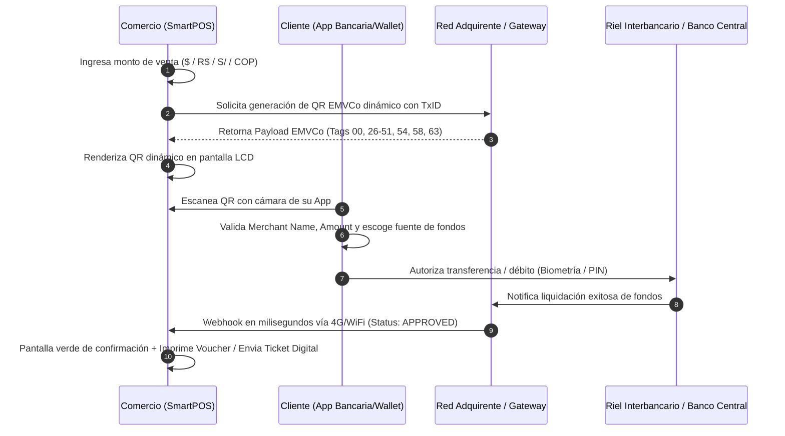

# Mapa de Ecosistema SmartPOS Android, Adquirentes y Apps con Lector QR en LATAM

> **Documento de Inteligencia y Arquitectura Técnica**  
> **Alcance:** América Latina (Brasil, México, Argentina, Perú, Colombia, Chile)  
> **Temas:** Fabricantes de Hardware SmartPOS, Modelos Homologados, Rieles A2A, Adquirentes, Ecosistema de +900 Apps Bancarias/Fintechs con Lector QR y Flujo Técnico EMVCo.

---

## 1. Visión General del Mercado

En América Latina, la adopción de pagos con **Código QR dinámico en terminales SmartPOS Android** (al igual que lo hace Topwise) es una de las tecnologías de mayor crecimiento en el procesamiento de adquirencia, impulsada por los sistemas de pagos inmediatos de bancos centrales:
* **Pix** (Banco Central de Brasil - BCB)
* **Transferencias 3.0** (Banco Central de la República Argentina - BCRA)
* **Yape / Plin** (Banco Central de Reserva del Perú - BCRP)
* **CoDi / Dimo** (Banco de México - Banxico)
* **Transfiya / Bre-B** (Banco de la República / Redeban / ACH Colombia)
* **Onepay / SII Integrado** (Chile)

---

## 2. 🛠️ Fabricantes y Modelos SmartPOS con QR Nativo en LATAM

Al igual que **Topwise** (`T6 Pro`, `T1`, `MP35P`), las siguientes marcas dominan el hardware de terminales con pantalla táctil, cámara y generador de QR dinámico:

| Fabricante | Modelos Principales en LATAM | Capacidades QR y Hardware |
| :--- | :--- | :--- |
| **PAX Technology** | A920 Pro, A930, A800, A35, A30 | Generación de QR dinámico EMVCo en pantalla de 5.5"–6.0", doble cámara (escaneo bidireccional) y lectura rápida. Es el hardware más usado por adquirentes en LATAM. |
| **Sunmi** | V2 Pro, V2s, P2, P2 Pro, P3 Mix | Terminales todo-en-uno con escáner láser/óptico de QR 1D/2D, pantalla táctil e impresora térmica integrada. |
| **NEXGO** | N5, N6, N82, KD68/KD70 (Soundbox QR) | Pantallas HD con generación de QR instantáneo y terminales Soundbox que anuncian por voz la confirmación del pago. |
| **Castles Technology** | Saturn 1000, S1F2, Vega 3000 | SmartPOS certificados PCI PTS 6.x con generación de QR en pantalla y lectura óptica. |
| **Ingenico (Worldline)** | AXIUM DX8000, EX8000 | Terminales Android corporativas utilizadas por la gran banca tradicional para cobros híbridos (Tarjeta + QR). |
| **Gertec** | GPOS700, MP20 | Hardware líder en Brasil con integración directa a adquirentes locales. |
| **Topwise** | T6 Pro, T1, MP35P | Terminales Android con procesador quad/octa-core, cámaras para lectura de códigos 2D y pantallas táctiles de alta definición para despliegue de QR EMVCo dinámico. |

---

## 3. 🌎 Despliegue por País: Adquirentes, Terminales y Billeteras Conectadas

```text
  [ Comprador con Wallet/App ] 
              │ (Escanea QR en pantalla)
              ▼
    ╔═══════════════════╗
    ║ SmartPOS Terminal ║ ──► [ Red Adquirente / Switch ] ──► [ Banco Central / Riel A2A ]
    ╚═══════════════════╝
```

---

### 🇧🇷 1. Brasil (El ecosistema QR más avanzado del mundo vía Pix)
En Brasil, prácticamente el 100% de los SmartPOS generan un **Pix QR Dinâmico** en pantalla con el valor exacto de la compra.

* **Terminales y Adquirentes:**
  * **Stone:** Stone Smart y Ton Smart (hardware PAX A920 / Sunmi P2).
  * **PagBank (PagSeguro):** Moderninha Smart 2 y Moderninha Pro 2 (Gertec / PAX).
  * **Cielo:** Cielo LIO (Android / Ingenico / PAX).
  * **Rede (Banco Itaú):** Smart Rede (PAX A920).
  * **Getnet Brasil (Santander):** Get Smart.
  * **Mercado Pago Brasil:** Point Smart y Point Pro 2.
* **Entidades Bancarias y Wallets compatibles:**
  * **Bancos:** Itaú, Bradesco, Banco do Brasil, Santander, Caixa Econômica.
  * **Fintechs / Neobancos:** Nubank, Banco Inter, C6 Bank, PicPay, Mercado Pago, PagBank.

---

### 🇲🇽 2. México (CoDi, Dimo y Ecosistemas Propietarios)
* **Terminales y Adquirentes:**
  * **Mercado Pago México:** Terminales Point Smart (PAX A920/A910) generan QR dinámico para cobrar con la app de Mercado Pago y tarjetas guardadas.
  * **Clip:** Clip Total 2, Clip Stand y Clip Pro 2 (hardware Sunmi / Nexgo modificado) con soporte de cobro por código QR y enlaces.
  * **Netpay:** Netpay Smart (Sunmi V2 Pro / PAX A920) con generación de QR en pantalla.
  * **Getnet México (Santander):** Terminales PAX A920 con soporte para cobro con QR CoDi y Dimo.
  * **BBVA SmartPOS & Banorte:** Terminales Ingenico AXIUM DX8000 y Castles Saturn con integración a CoDi.
* **Entidades Bancarias y Wallets compatibles:**
  * **Wallets:** Mercado Pago Wallet, Baz SuperApp, Spin by OXXO.
  * **Bancos:** BBVA México, Banorte Móvil, Santander, Citibanamex, Nu México, Hey Banco, Scotiabank, HSBC, BanRegio.

---

### 🇦🇷 3. Argentina (Transferencias 3.0 / QR Interoperable BCRA)
Por regulación del Banco Central de la República Argentina (BCRA), cualquier terminal SmartPOS que emita un código QR debe ser **interoperable**, permitiendo cobrar desde cualquier billetera bancaria o fintech.

* **Terminales y Adquirentes:**
  * **Payway (Prisma Medios de Pago):** Terminales Payway Smart (Castles Saturn 1000 / Newland N910) con QR interoperable en pantalla.
  * **Mercado Pago Point Smart:** Genera el QR dinámico de Transferencias 3.0 en pantalla.
  * **Ualá Bis:** POS Pro (Sunmi / PAX) con cobros QR acreditados en cuenta Ualá.
  * **Nave (Banco Galicia):** Terminales SmartPOS Galicia con QR integrado.
  * **Getnet Argentina (Santander):** PAX A920.
* **Entidades Bancarias y Wallets compatibles:**
  * **MODO:** Billetera unificada de más de 35 bancos (Galicia, Santander, BBVA, Macro, Nación, etc.).
  * **Fintechs/Bancos:** Mercado Pago, Cuenta DNI (Banco Provincia), BNA+, Ualá, Personal Pay, Brubank, Naranja X, Prex.

---

### 🇵🇪 4. Perú (Interoperabilidad Yape & Plin)
* **Terminales y Adquirentes:**
  * **Izipay:** Izipay Smart (PAX A920 / Sunmi V2 Pro) muestra en pantalla el QR interoperable para que el cliente pague con Yape o Plin.
  * **Niubiz (antes Visanet):** SmartPOS Niubiz (Ingenico AXIUM DX8000) genera QR dinámico interoperable.
  * **Culqi (Credicorp / BCP):** Culqi POS (Sunmi) integrado nativamente con QR Yape.
* **Entidades Bancarias y Wallets compatibles:**
  * **Yape:** BCP, Mibanco, cuentas con DNI (15M+ usuarios).
  * **Plin:** BBVA Perú, Interbank, Scotiabank, BanBif, Cajas Municipales (Arequipa, Cusco, Sullana, Piura, Huancayo).
  * **Otras:** Agora Pay, Bim.

---

### 🇨🇴 5. Colombia (QR Bancolombia, Transfiya y nuevo riel Bre-B)
* **Terminales y Adquirentes:**
  * **Bold:** Bold Smart y Bold Pro (hardware Nexgo / PAX) generan código QR en pantalla para cobros directos.
  * **Redeban & Credibanco:** Redes adquirentes tradicionales con terminales Android Ingenico y PAX que despliegan QR interoperable.
  * **Wompi (Bancolombia) / Treinta:** Terminales SmartPOS Sunmi con QR dinámico Bancolombia y Nequi.
* **Entidades Bancarias y Wallets compatibles:**
  * **Billeteras / Fintechs:** Nequi (18M+ usuarios), Daviplata, Dale!, Lulo Bank, Nu Colombia, Movii.
  * **Banca Tradicional:** Bancolombia App Personas, Davivienda Móvil, Banco de Bogotá, Banco de Occidente, Banco Popular, AV Villas.

---

### 🇨🇱 6. Chile (Onepay, Mercado Pago y Billeteras Bancarias)
* **Terminales y Adquirentes:**
  * **Transbank:** SmartPOS Transbank (Ingenico AXIUM / PAX A920) genera QR dinámico Onepay.
  * **Redelcom (Mercado Libre):** Terminales Sunmi V2 Pro con QR Mercado Pago.
  * **Tuu (Haulmer):** Terminales Sunmi con soporte para cobros QR integrados con boleta electrónica del SII.
  * **Klap & Compraquí (BancoEstado):** PAX A920 y Castles con QR BancoEstado / CuentaRUT.
* **Entidades Bancarias y Wallets compatibles:**
  * **Wallets / Apps:** Onepay, Mercado Pago, MACH (BCI), CuentaRUT / BancoEstado (14M+ usuarios), Tenpo, Fpay.

---

## 4. 📊 Universo de Apps con Lector QR Integrado en LATAM (+900 Apps)

En América Latina existen hoy **más de 900 aplicaciones móviles financieras** (entre banca tradicional, neobancos y billeteras fintech) que tienen un lector de código QR integrado directamente en su interfaz para pagar en terminales SmartPOS y comercios físicos.

### Resumen Consolidado por País

| País | N° Aprox. de Apps con Lector QR | Ecosistema / Estándar Principal | Nivel de Adopción |
| :--- | :--- | :--- | :--- |
| 🇧🇷 **Brasil** | 800+ apps | Pix QR (Banco Central de Brasil - BCB) | Universal (100%) |
| 🇦🇷 **Argentina** | 40+ apps | Transferencias 3.0 / MODO (BCRA) | Universal (98%) |
| 🇲🇽 **México** | 30+ apps | CoDi / Dimo / QR Mercado Pago (Banxico) | Medio-Alto (75%) |
| 🇨🇴 **Colombia** | 20+ apps | QR Redeban / Bancolombia / Bre-B | Alto (85%) |
| 🇵🇪 **Perú** | 15+ apps | Yape & Plin Interoperable (BCRP) | Muy Alto (95%) |
| 🇨🇱 **Chile** | 12+ apps | Onepay / Mercado Pago / Redelcom | Medio (60%) |

---

## 5. 🏦 Detalle de Implementación UI en Apps por País

### 🇲🇽 México (30+ Apps Activas)
En México, las apps permiten escanear terminales con QR CoDi/Dimo y terminales de Mercado Pago / Clip / Netpay:
* **Wallets y Fintechs (Las más usadas en comercios):**
  * **Mercado Pago México:** Botón central azul *"Escanear QR"* en el menú inferior. Lee terminales Point Smart y comercios asociados.
  * **Baz SuperApp (Banco Azteca):** Botón *"Pagar con QR"* en la pantalla de inicio.
  * **Spin by OXXO:** Botón *"Transferir / Escanear QR"*.
  * **Klar & Hey Banco:** Módulo de transferencias con escáner CoDi.
* **Banca Tradicional (Módulo CoDi / QR integrado):**
  * **BBVA México:** Menú *"Operaciones rápidas"* ➔ *"Pagar con CoDi"* (activa la cámara para leer el SmartPOS).
  * **Banorte Móvil:** Botón directo de *"CoDi QR"* en el carrusel de acceso rápido.
  * **Santander Móvil México:** Acceso a *"Cobro/Pago con Código CoDi"*.
  * **Citibanamex Móvil:** Pestaña *"CoDi / Transferencias QR"*.
  * **Scotiabank, HSBC México, Banco Azteca, Inbursa y BanRegio:** Módulos CoDi homologados por Banxico.

---

### 🇧🇷 Brasil (800+ Instituciones Financieras)
Por mandato del Banco Central (BCB), toda entidad con más de 500,000 cuentas activas debe tener Pix QR integrado en su aplicación móvil:
* **Neobancos y Fintechs:**
  * **Nubank (90M+ usuarios):** Botón *"Pagar com Pix"* ➔ *"Ler QR Code"*.
  * **PicPay (35M+ usuarios):** Botón verde central con ícono de escáner QR en el home.
  * **Mercado Pago Brasil:** Botón *"Código QR"*.
  * **Banco Inter:** Botón *"Pix"* ➔ *"Pagar com QR Code"*.
  * **C6 Bank & PagBank (PagSeguro):** Escáner nativo en barra de navegación.
* **Grandes Bancos:**
  * **Itaú, Bradesco, Banco do Brasil, Santander Brasil y Caixa Econômica (Caixa Tem):** Botón de cámara Pix destacado en el home de la app.

---

### 🇦🇷 Argentina (40+ Apps bajo el régimen Transferencias 3.0)
Cualquier app bancaria o fintech argentina puede escanear cualquier SmartPOS (Payway, Mercado Pago, Ualá Bis, Nave Galicia):
* **Ecosistema MODO (Billetera bancaria integrada en 35+ bancos):**
  * **App Santander Argentina:** Botón *"Pagar con MODO / QR"*.
  * **App Galicia:** Botón flotante *"Escanear QR"*.
  * **App BBVA Argentina:** Pestaña de pago MODO con cámara.
  * **App Banco Macro, Banco Nación (BNA+), Banco Ciudad, Banco Provincia (Cuenta DNI):** Botón de escaneo en la pantalla principal.
* **Fintechs y Billeteras Virtuales:**
  * **Mercado Pago Argentina:** Botón central *"Escanear QR"* (permite pagar con débito, dinero en cuenta o tarjetas de crédito guardadas).
  * **Ualá:** Botón *"Pagar con QR"* en la barra de herramientas.
  * **Personal Pay (Telecom):** Lector QR directo en el inicio.
  * **Brubank, Naranja X y Prex:** Escáner de QR interoperable.

---

### 🇵🇪 Perú (15+ Apps bajo Interoperabilidad Yape / Plin)
Los usuarios peruanos pueden escanear terminales Izipay, Niubiz y Culqi:
* **Yape (BCP / Mibanco - 15M+ usuarios):** Botón central *"Escanear QR"* para apuntar a la pantalla del SmartPOS.
* **Plin (Billetera integrada en múltiples bancos y cajas):**
  * **App BBVA Perú:** Botón *"Plin"* ➔ *"Escanear QR"*.
  * **App Interbank Perú:** Ícono de cámara QR Plin en acceso rápido.
  * **App Scotiabank Perú:** Módulo Plin QR.
  * **BanBif, Caja Arequipa, Caja Cusco, Caja Sullana, Caja Piura, Caja Huancayo:** Escáner QR Plin interoperable con Yape.
* **Agora Pay & Bim:** Lector QR para compras en retail y POS.

---

### 🇨🇴 Colombia (20+ Apps)
* **SuperApps y Billeteras Líderes:**
  * **Nequi (18M+ usuarios):** Botón de signo pesos `$` ➔ *"Escanea QR"*. Lee datáfonos Redeban, Bold, Credibanco y Bancolombia.
  * **Daviplata (Davivienda):** Botón *"Pagar con QR"* en el menú principal.
  * **Dale! (Grupo Aval):** Escáner QR interoperable con Transfiya.
* **Banca Tradicional:**
  * **Bancolombia App Personas:** Botón *"Pagar con QR"* en el carrusel de acceso antes y después de iniciar sesión.
  * **Davivienda Móvil, Banco de Bogotá, Banco de Occidente, Banco Popular y AV Villas:** Módulos de transferencias y pagos QR.
  * **Lulo Bank, Nu Colombia y Movii:** Compatibilidad con rieles de escaneo rápido.

---

### 🇨🇱 Chile (12+ Apps)
* **Transbank Onepay:** App especializada en escanear el QR emitido por terminales SmartPOS de Transbank.
* **Mercado Pago Chile:** Escáner QR para red de comercios y terminales Redelcom.
* **BancoEstado (CuentaRUT - 14M+ usuarios):** Botón *"PagoRUT / QR"*.
* **MACH (Banco BCI) y Tenpo:** Botón directo de escáner QR para pagar en comercios físicos.

---

## 6. 💡 Flujo Técnico y Operativo del QR en Terminales SmartPOS



### Componentes Clave del Flujo:
1. **QR Dinámico (Push Payment / C2B):**
   El comercio ingresa el monto en el SmartPOS (ej. `$250.00 MXN` o `R$ 50,00`). El terminal genera un código QR estándar **EMVCo** en su pantalla LCD frontal con el ID de transacción y monto precargado.
2. **Escaneo sin contacto y Selección de Fondos:**
   El cliente abre su aplicación bancaria o wallet preferida, escanea la pantalla del SmartPOS. La app interpreta el payload EMVCo e identifica al adquirente, comercio y monto. El usuario elige la fuente de fondos:
   * Saldo en cuenta bancaria / débito directo (A2A).
   * Tarjetas de crédito o débito guardadas en la wallet.
   * Líneas de crédito fintech (Mercado Crédito, Nu, etc.).
3. **Confirmación en Milisegundos:**
   La red de pagos envía un webhook al SmartPOS vía 4G/WiFi; la pantalla cambia a estado exitoso (verde), imprime el comprobante térmico (o lo envía por SMS/Email) y liquida los fondos de inmediato.
