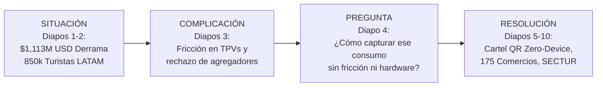

# MAZO EJECUTIVO: PROGRAMA ESTATAL "CARIBE MEXICANO SMART PAY"

**Presentación Institucional de Alto Impacto para FETUR & Secretaría de Turismo de Quintana Roo**  
**Metodología:** McKinsey SCQA & Pyramid Principle (Prueba del Mazo Fantasma)  
**Autor:** Antonio Gutiérrez — Presidente de la Comisión de Innovación Tecnológica y Pagos (FETUR)  
**Fecha:** 7 de Agosto de 2026  

---

## 👁️ THE GHOST DECK (PRUEBA DEL MAZO FANTASMA)
*Lea únicamente la secuencia de títulos accionables de las diapositivas 1 a 10 para recorrer la narrativa comercial completa:*

1. **Diapositiva 1:** Quintana Roo lidera la recepción de turismo sudamericano en México con una derrama en sitio de $1,113 Millones de Dólares.
2. **Diapositiva 2:** El 65% de los turistas de Brasil, Colombia, Argentina y Perú evita usar tarjetas tradicionales por comisiones e impuestos en sus países.
3. **Diapositiva 3:** Los agregadores locales no han resuelto el cobro por considerar el ruteo cambiario un proyecto de nicho regional.
4. **Diapositiva 4:** Presentamos "Caribe Mexicano Smart Pay", la infraestructura que conecta el cobro por QR nativo con liquidación en Pesos MXN.
5. **Diapositiva 5:** El modelo Zero-Device y Zero-ERP elimina la compra de TPVs y se integra directamente al software que los afiliados ya usan.
6. **Diapositiva 6:** La captación del turismo sudamericano permite a los comercios balancear la ocupación durante la temporada baja norteamericana.
7. **Diapositiva 7:** El modelo de inclusión social con Gafetes QR simplificados (CNBV Nivel 1 y 2) integra al comercio informal y guías turísticos.
8. **Diapositiva 8:** Un piso conservador del 1% del mercado ($3.5M USD) se alcanza con solo 113 transacciones diarias en 175 comercios clave.
9. **Diapositiva 9:** El respaldo de SECTUR Quintana Roo y ASETUR establece el piloto estatal como la antesala del escalamiento a nivel nacional.
10. **Diapositiva 10:** Plan de acción inmediato a 45 días para la circular de adhesión, entrega de kits y lanzamiento en rueda de prensa estatal.

---

## 📊 CONTENIDO DETALLADO DIAPOSITIVA POR DIAPOSITIVA

---

### 🟢 Diapositiva 1: Quintana Roo lidera la recepción de turismo sudamericano en México con una derrama en sitio de $1,113 Millones de Dólares

* **Plantilla Relacionada:** `executive-market-overview.zip` (McKinsey Metric Grid)
* **Visual / Estructura:** 4 Columnas de Métricas con Banderas de Países + Gráfico de Pie de Derrama por Categoría.
* **Contenido de la Diapositiva:**
  * 🇨🇴 **Colombia (380,000 turistas/año):** Gasto en sitio $1,039.55 USD por estancia ($395M USD Total).
  * 🇧🇷 **Brasil (150,000 turistas/año):** Gasto en sitio $1,209.00 USD por estancia ($181M USD Total).
  * 🇦🇷 **Argentina (160,000 turistas/año):** Gasto en sitio $1,125.75 USD por estancia ($180M USD Total).
  * 🇵🇪 **Perú (135,000 turistas/año):** Gasto en sitio $980.00 USD por estancia ($132M USD Total).
  * **Derrama Total en Sitio (TAM QRoo):** **$1,113.2 Millones de Dólares** (46% de todo el mercado de México).
* **Notas de Exposición:** *"Presidenta y Secretario: los 4 principales mercados sudamericanos traen más de 850,000 viajeros al año a Cancún, Riviera Maya y Tulum. Dejan más de $1,100 Millones de Dólares en dinero fresco directamente en las calles de nuestro estado."*

---

### 🟢 Diapositiva 2: El 65% de los turistas sudamericanos evita usar tarjetas tradicionales por comisiones e impuestos en sus países

* **Plantilla Relacionada:** `customer-friction-analysis.zip` (Dual Comparison Bar Chart)
* **Visual / Estructura:** Gráfico de Barras de Adopción por País vs. Barrera Impositiva.
* **Contenido de la Diapositiva:**
  * 🇧🇷 **Brasil (>65,000 Millones de txs PIX/año):** El 85% prefiere PIX para eludir el **3.5% de Impuesto IOF** del gobierno brasileño en tarjetas.
  * 🇦🇷 **Argentina (62% adopción eWallet):** Evitan tarjetas tradicionales para no pagar el **15-25% de recargo impositivo AFIP**.
  * 🇵🇪 **Perú (>40 Millones de txs Yape/día):** El 68% no utiliza tarjeta de crédito en viajes por temor a tasas de interés.
  * 🇨🇴 **Colombia (>78% adopción Nequi/DaviPlata):** Prevalencia masiva de pagos por llaves digitales y QR.
* **Notas de Exposición:** *"El turista sudamericano no usa tarjeta de crédito en Cancún porque le cuesta entre un 3.5% y un 25% más cara debido a los impuestos de su gobierno. Pagar con QR es su hábito #1 cotidiano."*

---

### 🔴 Diapositiva 3: Los agregadores bancarios locales no han resuelto el cobro por considerar el ruteo cambiario un proyecto de nicho regional

* **Plantilla Relacionada:** `market-gap-matrix.zip` (2x2 Matrix)
* **Visual / Estructura:** Matriz de Comparación: Agregadores Tradicionales vs. Necesidad del Sector Turístico.
* **Contenido de la Diapositiva:**
  * **El Bloqueo:** Agregadores masivos como Spin o Mercado Pago están enfocados en tiendas de conveniencia y consumo doméstico mexicano.
  * **Fricción Operativa:** Exigen integraciones complejas de 12 a 18 meses para habilitar ruteo cambiario (FX).
  * **La Oportunidad:** Dejan desatendido un mercado de $1,100M USD en Quintana Roo que exige una respuesta inmediata.
* **Notas de Exposición:** *"Los bancos y agregadores tradicionales le dan la espalda al turismo sudamericano porque solo buscan recargas de tienditas. Dejan libre una mina de oro que nosotros vamos a capturar."*

---

### 💡 Diapositiva 4: Presentamos "Caribe Mexicano Smart Pay", la infraestructura que conecta el cobro por QR nativo con liquidación en Pesos MXN

* **Plantilla Relacionada:** `solution-architecture-flow.zip` (3-Tier Ecosystem Architecture)
* **Visual / Estructura:** Diagrama de Flujo Transaccional de 3 Capas (Turista → Riel Internacional → Comercio).
* **Contenido de la Diapositiva:**
  * **Paso 1 (Turista):** Paga en Reales, Pesos o Soles escaneando con la app de su propio banco (Itaú, Nequi, Yape, MP).
  * **Paso 2 (Riel Internacional):** Conversión de divisa (FX) e interoperabilidad transfronteriza instantánea.
  * **Paso 3 (Comercio FETUR):** Recibe abono en Pesos Mexicanos (MXN) en su cuenta bancaria de siempre vía SPEI en <3 segundos.
* **Notas de Exposición:** *"Caribe Mexicano Smart Pay es el puente perfecto: el turista paga en la moneda de su país con su app bancaria de confianza, y el hotel o restaurante de FETUR recibe Pesos Mexicanos limpios en su banco."*

---

### ⚡ Diapositiva 5: El modelo Zero-Device y Zero-ERP elimina la compra de TPVs y se integra directamente al software que los afiliados ya usan

* **Plantilla Relacionada:** `no-hardware-deployment.zip` (Split Screen Visual)
* **Visual / Estructura:** Lado Izquierdo: Cartel de Acrílico QR de Mostrador; Lado Derecho: Integración con Soft Restaurant, Sunday, Duve y FareHarbor.
* **Contenido de la Diapositiva:**
  * **Zero Hardware:** Cero TPVs que comprar o rentar. Cero mantenimientos.
  * **Cartel QR Unificado:** 1 solo QR inteligente que identifica automáticamente el país del celular que escanea.
  * **Integración al Hub FETUR:** Habilitado sobre las plataformas actuales de los afiliados: **Sunday** (mesa), **Duve** (check-in), **FareHarbor** (tours) y **Soft Restaurant / Opera PMS** (caja).
* **Notas de Exposición:** *"No le pedimos al comercio que compre terminales ni que cambie de software. Le entregamos un cartel de acrílico elegante para la caja y nos conectamos con el sistema que ya usa todos los días."*

---

### ☀️ Diapositiva 6: La captación del turismo sudamericano permite a los comercios balancear la ocupación durante la temporada baja norteamericana

* **Plantilla Relacionada:** `seasonality-heat-map.zip` (Gantt Seasonality Matrix)
* **Visual / Estructura:** Mapa de Calor de Estacionalidad Mensual (EE.UU. vs. Sudamérica).
* **Contenido de la Diapositiva:**
  * **El Dolor del Sector:** Caída drástica de turismo norteamericano entre Mayo y Agosto (temporada baja tradicional).
  * **El Contra-Pico Sudamericano:** Picos MÁXIMOS de vacaciones escolares en Brasil, Colombia y Perú durante **Junio, Julio y Agosto**.
  * **El Beneficio:** Mantiene la ocupación hotelera y el consumo en restaurantes activo durante los meses más flojos de EE.UU.
* **Notas de Exposición:** *"Este programa sirve para salvar la temporada baja. Mientras los estadounidenses dejan de venir en verano, colombianos, brasileños y peruanos tienen sus picos vacacionales más altos en junio, julio y agosto."*

---

### 🛡️ Diapositiva 7: El modelo de inclusión social con Gafetes QR simplificados (CNBV Nivel 1 y 2) integra al comercio informal y guías turísticos

* **Plantilla Relacionada:** `social-inclusion-flow.zip` (Onboarding Journey)
* **Visual / Estructura:** Foto de Gafete QR de Cuello + Flujo de Registro en 3 Minutos.
* **Contenido de la Diapositiva:**
  * **Inclusión de la Economía Informal ($350M USD Ocultos):** Lancheros de Cozumel, artesanos de Playa del Carmen, puesteros de playa y guías de Tulum.
  * **Registro Simplificado CNBV (Cero RFC Obligatorio):** Registro en 3 minutos con solo foto de INE.
  * **Liquidación a Tarjeta Actual:** Depósito directo a cualquier tarjeta que posean (**Spin OXXO, BanCoppel, Mercado Pago, BBVA**).
* **Notas de Exposición:** *"Llevamos la tecnología hasta la playa. El lanchero o artesano se cuelga su gafete QR al cuello y recibe los depósitos de los turistas brasileños en su tarjeta de BanCoppel o Spin sin trámites fiscales."*

---

### 🧮 Diapositiva 8: Un piso conservador del 1% del mercado ($3.5M USD) se alcanza con solo 113 transacciones diarias en 175 comercios clave

* **Plantilla Relacionada:** `financial-floor-model.zip` (Funnel & Target Breakdown)
* **Visual / Estructura:** Funnel de Conversión SAM -> SOM + Mapa de Zonas de Quintana Roo.
* **Contenido de la Diapositiva:**
  * **SAM Formal Quintana Roo:** $350.6 Millones de USD / año.
  * **Meta del Piso 1% (Año 1):** **$3,506,000 USD procesados** (~$3.5 M USD).
  * **Comercios Requeridos (Tier 1 Pareto):** **175 comercios de Alta Densidad LATAM** (el 35% de los afiliados de FETUR).
  * **Distribución de Transacciones Diarias:** 40 Cancún + 35 Playa del Carmen + 25 Tulum + 13 Cozumel = **113 transacciones al día en todo el estado**.
* **Notas de Exposición:** *"Nuestra meta de piso no es una ilusión. Con solo 175 comercios procesando 1 solo cobro al día en todo Quintana Roo, alcanzamos $3.5 Millones de Dólares en el primer año."*

---

### 🏛️ Diapositiva 9: El respaldo de SECTUR Quintana Roo y ASETUR establece el piloto estatal como la antesala del escalamiento a nivel nacional

* **Plantilla Relacionada:** `national-roadmap-expansion.zip` (Mexico Map Expansion)
* **Visual / Estructura:** Mapa de México con Fase 1 (QRoo) y Fase 2 (Los Cabos, Puerto Vallarta, CDMX).
* **Contenido de la Diapositiva:**
  * **Fase 1 (Piloto Quintana Roo - FETUR):** Punta de lanza e innovación con el Secretario de Turismo de QRoo.
  * **Fase 2 (Escalamiento Federal ASETUR):** Presentación en la Unión de Secretarios de Turismo de México para replicar en Los Cabos, Puerto Vallarta y CDMX.
  * **Mercado Receptor Nacional:** Más de 1.8 Millones de turistas sudamericanos al año (**+$2,400M USD en sitio**).
* **Notas de Exposición:** *"Con Quintana Roo a la cabeza y el respaldo de ASETUR, este piloto posiciona a nuestro estado como el líder nacional de tecnología turística antes de expandir a Los Cabos y la CDMX."*

---

### 🎯 Diapositiva 10: DASHBOARD DE CIERRE — Próximos Pasos a 45 Días y Preguntas (Q&A)

* **Plantilla Relacionada:** `closing-dashboard-qa.zip` (Action Checklist & Q&A Dashboard)
* **Visual / Estructura:** Dashboard de 4 Cuadrantes con Hoja de Ruta de 45 días (Permanece en pantalla durante las preguntas).
* **Contenido de la Diapositiva:**
  * 📋 **Días 1 - 15:** Emisión de Circular Institucional de FETUR a los 175 comercios Tier 1.
  * 📦 **Días 16 - 30:** Reparto del Kit "Cartel de Pago QR" e integración con Soft Restaurant / Sunday.
  * 🎤 **Días 31 - 45:** Rueda de Prensa de Estado con SECTUR QRoo y lanzamiento oficial.
  * 🚀 **Días 46+:** Inicio de procesamiento y auditoría de volumen.
* **Notas de Exposición:** *"Estamos listos para ejecutar. Dejo en pantalla la hoja de ruta de los primeros 45 días para abrir la mesa de preguntas y coordinar el arranque."*

---

*Mazo ejecutivo McKinsey registrado y formalizado en `riviera-maya-payments`.*
