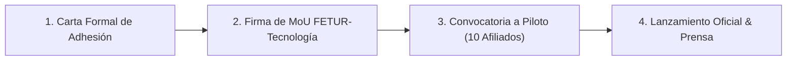

# MEMORÁNDUM DE ENTENDIMIENTO Y SEGUIMIENTO ESTRATÉGICO — FETUR x ANTONIO GUTIÉRREZ

**Para:** Presidencia y Consejo Directivo — Federación de Empresarios Turísticos de México (FETUR)  
**De:** Antonio Gutiérrez — Estratega de Tecnología y Soluciones de Pago B2B  
**Fecha:** 7 de Agosto de 2026  
**Asunto:** Formalización de Alianza Estratégica, Comité de Innovación en Pagos Internacionales e Implementación de TPVs con APMs (PIX / América del Sur) en Quintana Roo  

---

##  EXECUTIVE SUMMARY

Tras el diálogo sostenido con la Presidencia de FETUR y la coincidencia plena en la visión de desarrollo turístico sustentable y competitivo para Quintana Roo, se establece el presente documento como **hoja de ruta de formalización** para:

1. **Incorporación a la Asociación:** Creación y liderazgo del *Comité de Innovación Tecnológica y Soluciones de Pago Internacionales* dentro de FETUR.
2. **Recuperación del Flujo Turístico Sudamericano:** Implementación de Terminales Punto de Venta (TPV) con soporte nativo de Métodos de Pago Alternativos (APMs) como **PIX (Brasil)** y transferencias locales de **Argentina/Colombia**, eliminando la barrera del 4-7% de sobrecosto por tipo de cambio y el 3.5% de IOF.
3. **Plan Piloto Riviera Maya / Cancún:** Despliegue prioritario en una red selecta de afiliados FETUR (Hoteles boutique, Parques, Restaurantes y agencias receptivas).

---

## 🎯 PROPUESTA DE ROL Y ESTRUCTURA EN FETUR

### **Comité de Innovación Tecnológica y Soluciones de Pago**
* **Líder de Comité:** Antonio Gutiérrez.
* **Objetivo Comercial y Turístico:** Posicionar a Quintana Roo como el primer destino turístico *APM-Native* de América Latina, incrementando el gasto promedio en destino del turista sudamericano en un **+25% al +35%**.
* **Alcance:**
  * Capacitación a afiliados de FETUR en cobros transfronterizos sin fricción.
  * Certificación de "Establecimiento Amigable con Pagos Sudamericanos" (*PIX-Ready / Latin-Pay Certified*).
  * Gestión de alianzas técnicas con procesadores de pago (TPVs) e instituciones financieras participantes.

---

## 📋 HOJA DE RUTA DE FORMALIZACIÓN (4 PASOS)

### **Fase 1: Minuta de Confirmación y Carta de Adhesión (Día 1-3)**
* Emisión y firma de la Carta de Intención formalizando la integración de Antonio Gutiérrez al cuerpo técnico/asesor de FETUR.
* Definición de objetivos e hitos clave del Comité para el Q3-Q4 2026.

### **Fase 2: Convocatoria al Programa Piloto "Quintana Roo Pay-Express" (Día 4-10)**
* Selección de **10 a 15 afiliados clave de FETUR** en Cancún, Playa del Carmen y Tulum (Hotelería, Gastronomía, Tours).
* Instalación y configuración de TPVs equipadas con código QR para cobro en reales (PIX) con liquidación inmediata en MXN/USD para el comercio local.

### **Fase 3: Capacitación Operativa y Material P.O.P. (Día 11-15)**
* Entrega de señalética oficial para mostradores y recepción: *"Aceptamos PIX y Pagos Directos de Sudamérica"*.
* Capacitación de 15 minutos al personal de caja y recepción para procesamiento de cobros en menos de 10 segundos.

### **Fase 4: Rueda de Prensa y Presentación Institucional (Día 16-20)**
* Anuncio conjunto FETUR x Secretaría de Turismo / Cámaras Empresariales sobre la modernización de los pagos turísticos en la entidad.

---

## 💡 CARTA DE SEGUIMIENTO PARA ENVIAR A LA PRESIDENTA (TEXTO SUGERIDO)

> **Estimada Presidenta de FETUR,**
>
> Fue un verdadero honor conversar con usted y constatar nuestro entusiasmo compartido por impulsar el crecimiento económico y tecnológico del turismo en Quintana Roo.
>
> Coincido plenamente en que la reactivación del mercado sudamericano (particularmente Brasil y Argentina) requiere soluciones concretas que eliminen las comisiones bancarias abusivas y faciliten el consumo en nuestros negocios locales.
>
> Agradezco enormemente su invitación para sumarme a FETUR y liderar las iniciativas de innovación tecnológica y pagos. Con el fin de dar el siguiente paso y formalizar este esfuerzo conjunto, he preparado la propuesta de hoja de ruta y la estructura del **Comité de Innovación en Pagos Internacionales**.
>
> Quedo a su entera disposición para reunirnos a revisar los detalles y firmar la carta de adhesión formal cuando su agenda lo permita.
>
> Un cordial saludo,  
> **Antonio Gutiérrez**  
> *Estratega de Tecnología y Soluciones de Pago B2B*

---

*Documento formalizado y registrado en el repositorio `riviera-maya-payments`.*
