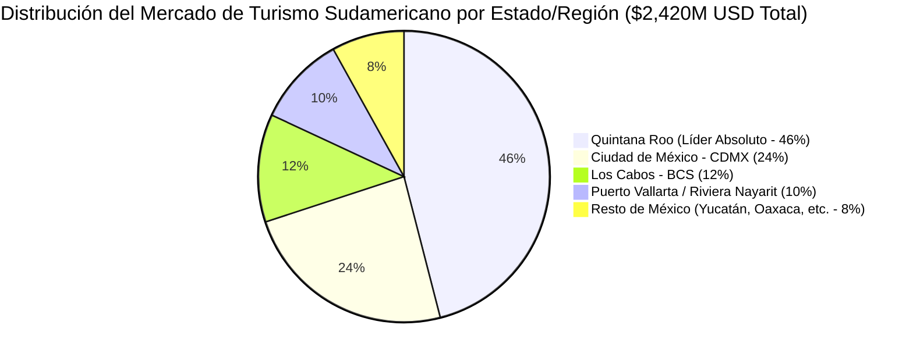

# MODELO FINANCIERO REGIONAL DE MERCADO (TAM, SAM, SOM) Y DATA DURA DE PENETRACIÓN QR EN LATAM

**Estudio de Adopción y Modelado de Captura por Estado y Escenarios Conservadores**  
**Fuentes Oficiales:** Banco Central do Brasil, Banco de la República de Colombia, BCRP Perú, BCRA Argentina, DATATUR / SECTUR  
**Autor:** Antonio Gutiérrez — Liderazgo de Innovación en Pagos Turísticos  
**Fecha:** 7 de Agosto de 2026  

---

## 🏛️ 1. GLOSARIO EJECUTIVO DE SIGLAS FINANCIERAS

* **TAM (Total Addressable Market / Mercado Total Teórico):** El 100% del gasto en sitio de turistas sudamericanos en todo México.
* **SAM (Serviceable Addressable Market / Mercado Servible):** El gasto que ocurre dentro de establecimientos comerciales bancarizados equipados con TPVs/QR.
* **SOM (Serviceable Obtainable Market / Mercado Obtensible Real):** La captura real esperada en Año 1 y Año 2 aplicando escenarios conservadores de adopción.

---

## 🗺️ 2. DESGLOSE DEL TAM Y SAM POR REGIONAL / ESTADO EN MÉXICO

México recibe **1,850,000 turistas sudamericanos al año** (Brasil, Colombia, Argentina, Perú) con una derrama total en sitio de **$2,420 Millones de Dólares**.

### **Tabla Comparativa Regional (Derrama y Cobertura SAM):**

| Estado / Región | Turistas Anuales | Derrama Total en Sitio (TAM) | Mercado Formal Servible (SAM - 31.5%) |
| :--- | :--- | :--- | :--- |
| 🏝️ **Quintana Roo (Cancún/Riviera Maya)** | **850,000 (46%)** | **$1,113.2 Millones USD** | **$350.6 Millones USD** |
| 🏙️ **Ciudad de México (CDMX)** | **444,000 (24%)** | **$580.8 Millones USD** | **$182.9 Millones USD** |
| 🌵 **Los Cabos (Baja California Sur)** | **222,000 (12%)** | **$290.4 Millones USD** | **$91.4 Millones USD** |
| 🌅 **Puerto Vallarta / Riviera Nayarit** | **185,000 (10%)** | **$242.0 Millones USD** | **$76.2 Millones USD** |
| 🏛️ **Resto de México (Yucatán/Oaxaca)** | **149,000 (8%)** | **$193.6 Millones USD** | **$60.9 Millones USD** |
| **TOTALES NACIONAL MÉXICO** | **1,850,000 Turistas** | **$2,420.0 Millones USD** | **$762.0 Millones USD** |

---

## 📱 3. DATA DURA DE PENETRACIÓN DEL USO DE QR EN PAÍSES SUDAMERICANOS

Para eliminar cualquier duda o escepticismo sobre si el turista "sabrá o querrá usar el QR en México", la data de los Bancos Centrales demuestra que **el uso del QR en Sudamérica es masivo y cotidiano (cero barrera de adopción)**:

### 🇧🇷 **BRASIL (PIX — Banco Central do Brasil 2025-2026):**
* **Penetración:** **>90% de la población bancarizada** usa PIX cotidianamente.
* **Volumen Anual:** **Más de 65,000 MILLONES de transacciones** al año.
* **Comportamiento:** El brasileño usa PIX para comprar desde un agua de coco en la playa hasta un hotel. Pagar con QR es su hábito #1.

### 🇵🇪 **PERÚ (Yape / Plin — Banco Central de Reserva del Perú BCRP):**
* **Penetración:** **>82% de la población adulta bancarizada** (Yape supera los 17 millones de usuarios activos).
* **Volumen Diario:** **Más de 40 MILLONES de transacciones diarias**.
* **Comportamiento:** El peruano "yapea" para cualquier cobro cotidiano. Cero uso de tarjeta de plástico.

### 🇨🇴 **COLOMBIA (Bre-B / Nequi / Daviplata — Banco de la República):**
* **Penetración:** **>78% de los adultos en Colombia** (Nequi y Daviplata superan los 21 millones de usuarios activos).
* **Comportamiento:** El QR es el estándar de cobro en restaurantes, supermercados y taxis.

### 🇦🇷 **ARGENTINA (Mercado Pago / Interoperabilidad CBU — BCRA):**
* **Penetración:** **>85% de la población con Smartphone** utiliza Mercado Pago o billeteras QR interoperables.

---

## 📈 4. MODELADO DE ESCENARIOS DE USO CONSERVADORES (SOM EN QUINTANA ROO)

Para presentar proyecciones financieras realistas y conservadoras ante FETUR y Motor PSP Aliado en Quintana Roo (SAM de **$350.6M USD**):

| Escenario de Adopción | % Captura del SAM en Año 1 | Volumen Procesado (SOM) | Revenue Bruto PSP (2.0% Take Rate) | Tu Comisión (0.20% BPS) |
| :--- | :--- | :--- | :--- | :--- |
| 🛡️ **Ultra-Conservador (Pesimista)** | **8% del SAM** | **$28.0 Millones USD** | **$560,000 USD** | **$56,000 USD ($1.1M MXN)** |
| ⚖️ **Escenario Base (Moderado)** | **18% del SAM** | **$63.1 Millones USD** | **$1,262,000 USD** | **$126,200 USD ($2.5M MXN)** |
| 🚀 **Escenario Optimista (Escala)** | **35% del SAM** | **$122.7 Millones USD** | **$2,454,000 USD** | **$245,400 USD ($4.9M MXN)** |

---

## 🎯 CONCLUSIONES PARA PITCH INSTITUCIONAL:

1. **Quintana Roo lidera con el 46% del mercado nacional**, lo que valida que Cancún/Riviera Maya es el punto de partida perfecto antes de escalar con ASETUR a CDMX y Los Cabos.
2. **Cero Barrera de Adopción:** Los turistas brasileños (PIX >65B txs/año) y peruanos (Yape >40M txs/día) ya están educados al 100% en pagar con QR.
3. **Incluso en el Escenario Ultra-Conservador (8% de captura)**, el proyecto genera **$28M USD en volumen** y **+$1.1M MXN en comisiones directas**.

---

*Modelo financiero regional y datos de penetración QR guardados en `riviera-maya-payments`.*
