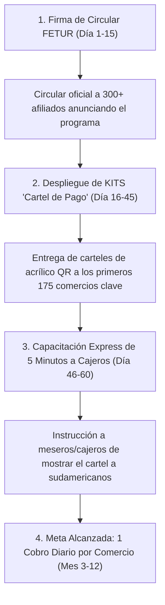

# MODELO PISO EXTREMO (1% DEL SAM) Y PLAN GTM DE AFILIACIÓN DE COMERCIOS

**Análisis de Mínimo Viable Operativo (Floor Stress Test) y Unit Economics**  
**Proyecto:** Pagos Turísticos LATAM (PIX, Bre-B, Yape, Mercado Pago)  
**Autor:** Antonio Gutiérrez — Estratega de Tecnología y Soluciones de Pago B2B  
**Fecha:** 7 de Agosto de 2026  

---

## 📉 1. CÁLCULO DEL ESCENARIO "PISO DE LOS PISOS" (1% DEL SAM EN AÑO 1)

Tomando el **SAM de Quintana Roo (Mercado Formal Servible = $350.6 Millones de USD)**:

### **El 1% del SAM (Meta Mínima Viable del Piloto):**
* **Volumen Procesado en Año 1:** $\mathbf{\$3,506,000 \text{ USD / año}}$ (~$3.5 Millones de Dólares).
* **Ingreso Bruto PSP (2.0% Take Rate):** **$70,120 USD** (~$1.4 Millones de Pesos MXN).
* **Tu Comisión Personal (0.20% BPS):** **$7,012 USD** (~$140,000 Pesos MXN).

*(Nota: El 1% de 1% = 0.01% representaría $35,000 USD procesados, un escenario estático sin operación real. La meta de entrada para cualquier piloto real es el **1% del SAM**).*

---

## 🏢 2. ¿CUÁNTOS NEGOCIOS SE NECESITAN PARA CAPTURAR ESE 1% ($3.5M USD)?

### **Unit Economics del Comercio Promedio:**
* **Ticket Promedio por Transacción APM:** **$85 USD** (comida en restaurante medio/alto, tour, actividad, souvenir).
* **Transacciones totales necesarias al año:**
  $$\frac{\$3,506,000 \text{ USD}}{\$85 \text{ USD / ticket}} = 41,247 \text{ transacciones al año} \approx \mathbf{113 \text{ transacciones diarias en todo el estado}}$$
* **Facturación Anual en APM por Comercio Activo:** ~$20,000 USD / año (equivalente a procesar 20 cobros al mes).

### **Número de Comercios Requeridos:**
$$\frac{\$3,506,000 \text{ USD}}{\$20,000 \text{ USD por comercio/año}} = \mathbf{175 \text{ COMERCIOS AFILIADOS}}$$

> 💡 **Conclusión Clave:**  
> Para alcanzar el 1% del SAM ($3.5M USD), **solo necesitamos afiliar 175 comercios** en todo Quintana Roo. Esto equivale a capturar únicamente el **5% al 8% de los miembros de FETUR**.

---

## 🗺️ 3. PLAN DE ACCIÓN DE 4 PASOS PARA LOGRAR LOS 175 COMERCIOS (GTM)

### **Paso 1: Circular Institucional FETUR (Días 1 a 15)**
* La Presidenta de FETUR envía una circular a los 300+ comercios afiliados anunciando la incorporación de la tecnología de cobros sudamericanos sin costo de terminales ni mensualidades.

### **Paso 2: Distribución de 175 Kits "Cartel de Pago" (Días 16 a 45)**
* Repartir físicamente el cartel de acrílico con el **1 Solo QR Inteligente** a los 175 comercios con mayor afluencia:
  * **60 Restaurantes & Bares** en Quinta Avenida (Playa del Carmen) y Cancún Zona Hotelera.
  * **50 Agencias de Tours & Excursiones** (taquillas de catamaranes, cenotes).
  * **45 Hoteles Boutique & Recepciones** en Tulum y Holbox.
  * **20 Tiendas de Retail & Souvenirs**.

### **Paso 3: Capacitación Express de 5 Minutos al Cajero (Días 46 a 60)**
* Capacitar al personal de caja con una regla simple:  
  * *"Cuando detectes a un cliente de Brasil, Colombia, Perú o Argentina, ponle el cartel enfrente y dile que puede pagar en Reales, Pesos o Soles desde su celular."*

### **Paso 4: Auditoría de 1 Cobro Diario por Negocio (Meses 3 a 12)**
* Con que cada uno de esos 175 comercios procese **tan solo 1 cobro diario por QR**, superamos la meta del 1% del SAM ($3.5 Millones de USD).

---

*Modelo de piso 1% y plan de acción GTM guardado en `riviera-maya-payments`.*
