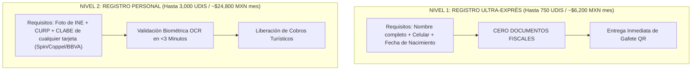

# MODELO DE ONBOARDING SIMPLIFICADO Y CUMPLIMIENTO KYC PARA EL COMERCIO INFORMAL

**Arquitectura de Registro Expreso y Cumplimiento Normativo CNBV (Cero Burocracia)**  
**Proyecto:** Pagos Turísticos LATAM (PIX, Bre-B, Yape, Mercado Pago)  
**Autor:** Antonio Gutiérrez — Estratega de Tecnología y Soluciones de Pago B2B  
**Fecha:** 7 de Agosto de 2026  

---

## 🎯 EL RETO DE CUMPLIMIENTO E IDENTIFICACIÓN

El micro-comerciante informal (artesano de playa, lanchero de Cozumel, puestero de artesanías):
1. **NO tiene Constancia de Situación Fiscal (SAT)** ni Acta Constitutiva.
2. **NO aceptará trámites burocráticos** ni visitas a sucursales bancarias.
3. Requiere recibir sus Pesos MXN de inmediato en cualquier cuenta o tarjeta que ya posea (**Spin OXXO, BanCoppel, Mercado Pago, BBVA**).

---

## ⚖️ EL MARCO REGULATORIO: CUENTAS SIMPLIFICADAS CNBV (NIVEL 1 Y NIVEL 2)

Bajo las disposiciones de la **CNBV para Instituciones de Pago Electrónico (Ley Fintech / Disposiciones de Operaciones)**, el onboarding se estructura en 2 niveles de fricción cero:

---

## 📱 EL FLUJO DE ONBOARDING EN 3 PASOS (MENOS DE 3 MINUTOS)

### **Paso 1: Escaneo del QR de Registro**
El artesano o lanchero escanea un QR de registro en su propio celular (o es auxiliado por un promotor de campo de FETUR).

### **Paso 2: Captura Digital Exprés (Self-Onboarding)**
* Toma foto por ambos lados de su **INE vigente**.
* Ingresa su **CURP** y número de celular.
* Ingresa la **CLABE Interbancaria (18 dígitos)** de la tarjeta donde quiere recibir su dinero (aceptando tarjetas populares de baja fricción como **Spin by OXXO, BanCoppel, Mercado Pago o BBVA**).

### **Paso 3: Validación Automática y Entrega de Gafete QR**
* La plataforma realiza la **validación biométrica y contraste de INE contra RENAPO** en tiempo real (menos de 60 segundos).
* Al validarse, se le emite su **Gafete / Credencial Rígida QR Oficial** para colgarse al cuello o colocar en su mostrador.

---

## 🤝 JORNADAS DE AFILIACIÓN DE CAMPO (FETUR EN ACCIÓN)

Para acelerar la adopción en cooperativas de lancheros, artesanos de la Quinta Avenida y guías de Tulum:

1. **Jornadas de Afiliación en Sitio:** FETUR organiza brigadas de 2 personas equipadas con tablets y una impresora de credenciales rígidas.
2. **Registro e Impresión al Instante:** En 5 minutos, el lanchero o artesano completa su registro digital Nivel 2 y sale con su **Gafete QR oficial de Caribe Mexicano Smart Pay** colgado al cuello.
3. **Incentivo de Inclusión Social:** FETUR se consolida como el motor de bancarización y formalización progresiva del micro-turismo en Quintana Roo.

---

*Modelo de onboarding simplificado KYC para comercio informal guardado en `riviera-maya-payments`.*
