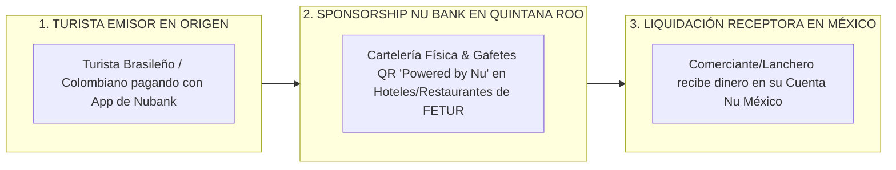

# PROPUESTA DE PATROCINIO ESTRATÉGICO Y SPONSORSHIP: NU BANK (NUBANK / NU MÉXICO)

**Propuesta C-Suite de Alianza Institucional y Posicionamiento de Marca**  
**Proyecto:** Caribe Mexicano Smart Pay — Infraestructura de Pagos Receptivos LATAM  
**Vínculo Institucional:** FETUR (Federación de Empresarios Turísticos) & Secretaría de Turismo de QRoo  
**Target Pitch:** CEO / C-Suite Leadership Nu Bank (David Vélez / Ivan Canales)  
**Autor:** Antonio Gutiérrez — Liderazgo de Innovación en Pagos Turísticos  
**Fecha:** 7 de Agosto de 2026  

---

## 💜 1. LA CONEXIÓN PERFECTA: POR QUÉ NU BANK ES EL SPONSOR IDEAL

Nu Bank (Nubank) es el **neobanco más grande de América Latina** (+100 Millones de clientes) y posee una posición estratégica trilateral única:
1. 🇧🇷 **En Brasil (País de Origen de Nu):** Nubank es el líder absoluto en adopción de PIX.
2. 🇨🇴 **En Colombia:** Nu Colombia registra un crecimiento exponencial en eWallets.
3. 🇲🇽 **En México:** Nu México es la entidad de finanzas digitales de mayor crecimiento del país.

---

## 🎯 2. ¿QUÉ GANA NU BANK AL SER EL SPONSOR DEL PROYECTO?

### **A. Co-Branding de Marca Exclusivo ("Caribe Mexicano Smart Pay powered by Nu")**
* **Presencia en 1,000+ Comercios:** Los carteles de acrílico y gafetes QR en mostradores de restaurantes, hoteles de FETUR y taquillas de tours llevan el sello institucional morado de Nu.
* **Familiaridad Instantánea:** El turista brasileño o colombiano que aterriza en Cancún ve el logo de Nu en la caja y escanea con confianza inmediata.

### **B. Captura de Cuentahabientes en México (Nu México Payout Wallet)**
* Promover la **Cuenta Nu México** como la tarjeta predilecta de liquidación para los lancheros, artesanos y meseros de Quintana Roo.

### **C. Posicionamiento ante la Secretaría de Turismo y Gobernación**
* Nu se consolida ante el Gobierno del Estado de Quintana Roo y ASETUR como el neobanco pionero que financió la digitalización del turismo en el Caribe Mexicano.

---

## 💬 3. EL PITCH EJECUTIVO PARA PRESENTAR A LA DIRECCIÓN DE NU

> *"Estimado David / Ivan / Equipo Directivo de Nu:*
>
> *Tengo abierta la alianza institucional con la **Federación de Empresarios Turísticos (FETUR)** y el apoyo del **Secretario de Turismo de Quintana Roo** para lanzar la infraestructura de pagos por QR para el turismo sudamericano en Cancún, Riviera Maya y Tulum.*
>
> *Como Nu es el gigante que une a **Brasil, Colombia y México**, queremos invitarlos a ser el **Sponsor Principal Exclusivo de Marca** del programa 'Caribe Mexicano Smart Pay'.*
>
> *Colocamos la marca Nu en la cartelería física de más de **1,000 comercios turísticos**, capturamos miles de nuevas Cuentas Nu México entre los comerciantes locales y posicionamos a Nu como el motor de inclusión financiera del Caribe Mexicano sin que ustedes tengan que desarrollar software de adquirencia."*

---

*Propuesta de patrocinio estratégico con Nu Bank guardada en `riviera-maya-payments`.*
