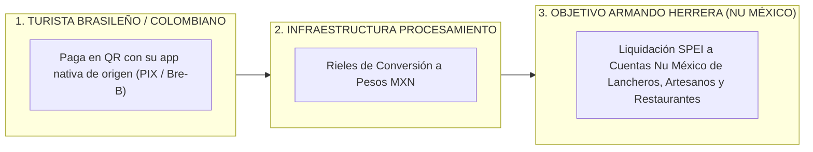

# PROPUESTA DE PATROCINIO ESTRATÉGICO: ARMANDO HERRERA (NU MÉXICO)

**Propuesta C-Suite de Alianza Institucional y Captación de Cuentahabientes**  
**Proyecto:** Caribe Mexicano Smart Pay — Infraestructura de Pagos Receptivos LATAM  
**Vínculo Institucional:** FETUR (Federación de Empresarios Turísticos) & Secretaría de Turismo de QRoo  
**Target Pitch:** Armando Herrera (Nu México)  
**Autor:** Antonio Gutiérrez — Liderazgo de Innovación en Pagos Turísticos  
**Fecha:** 7 de Agosto de 2026  

---

## 💜 1. POR QUÉ ESTO ALINEA 100% CON LOS KPIS DE NU MÉXICO

Para **Armando Herrera y el equipo directivo de Nu México**, las dos prioridades estratégicas más importantes en el país son:
1. **Aumentar la captación de depósitos (Float)** en las **Cuentas Nu** (Cajitas de ahorro y débito).
2. **Expandir la bancarización de trabajadores independientes y comercios** en zonas de alto flujo económico como Quintana Roo.

---

## 🎯 2. ¿QUÉ GANAN ARMANDO HERRERA Y NU MÉXICO CON ESTA ALIANZA?

### **A. Captación Masiva de Nuevas Cuentas Nu México (Payout Wallet Preferida)**
* Presentar la **Cuenta Nu México** como la tarjeta y cuenta preferida para que miles de comerciantes, meseros y guías turísticos de Quintana Roo reciban diariamente sus ventas a turistas sudamericanos.

### **B. Co-Branding de Marca en +1,000 Comercios Turísticos ("Powered by Nu México")**
* Colocar el sello morado institucional de Nu México en los carteles de acrílico y gafetes QR en restaurantes de la Quinta Avenida, recepciones de hoteles de FETUR y taquillas de tours.

### **C. Alianza de Alto Nivel con SECTUR Quintana Roo**
* Posicionar a Nu México ante la Secretaría de Turismo del Estado y el Secretario de Turismo como la entidad Fintech patrocinadora que impulsó la inclusión financiera del Caribe Mexicano.

---

## 💬 3. EL PITCH DIRECTO PARA ARMANDO HERRERA (NU MÉXICO):

> *"Estimado Armando:*
>
> *Tengo abierta la alianza institucional con la **Federación de Empresarios Turísticos (FETUR)** y el respaldo del **Secretario de Turismo de Quintana Roo** para desplegar la infraestructura de cobro por QR para el turismo sudamericano en Cancún, Riviera Maya y Tulum.*
>
> *Queremos proponer a **Nu México** como el **Sponsor Principal y Cuenta Receptora Preferida** del programa 'Caribe Mexicano Smart Pay'.*
>
> *Les llevamos miles de nuevos cuentahabientes activos en Quintana Roo recibiendo depósitos diarios en sus Cuentas Nu, presencia de marca exclusiva en más de **1,000 comercios turísticos** y el respaldo institucional de la Secretaría de Turismo del Estado, sin que Nu México tenga que desarrollar software de adquirencia."*

---

*Propuesta enfocada a Armando Herrera (Nu México) guardada en `riviera-maya-payments`.*

