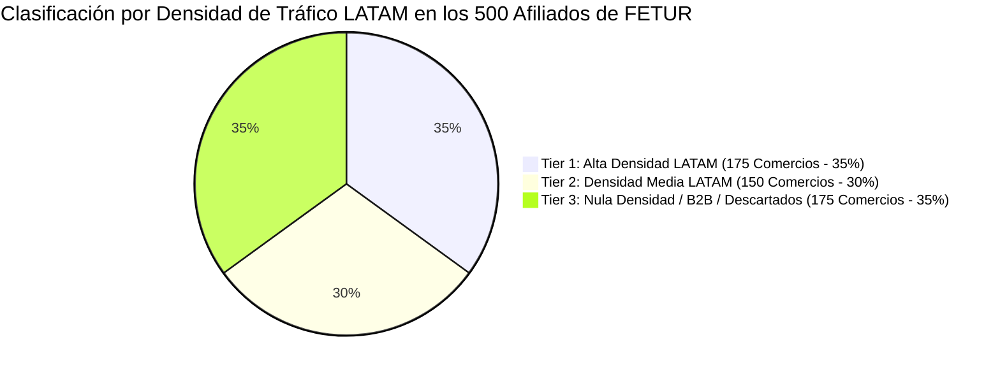

# MATRIZ DE SEGMENTACIÓN DE AFILIADOS DE FETUR (PARETO 80/20)

**Filtrado por Densidad de Tráfico Turístico de Brasil, Colombia, Argentina y Perú**  
**Proyecto:** Pagos Turísticos LATAM (PIX, Bre-B, Yape, Mercado Pago)  
**Autor:** Antonio Gutiérrez — Estratega de Tecnología y Soluciones de Pago B2B  
**Fecha:** 7 de Agosto de 2026  

---

## 🎯 EL FILTRADO DE REALIDAD SOBRE LOS 500 AFILIADOS DE FETUR

De los **500 comercios afiliados a FETUR**, **NO todos reciben turistas sudamericanos**. Muchos son proveedores B2B, oficinas corporativas, bienes raíces o negocios locales enfocados 100% en residentes mexicanos.

Aplicando la **Regla de Pareto (80/20)**, el consumo sudamericano se concentra fuertemente en un grupo prioritario de **175 comercios clave (35% de los afiliados)**.

---

## 🏬 DESGLOSE DE TIERS DE AFILIADOS

### 🔴 **TIER 1: ALTA DENSIDAD LATAM — LOS 175 COMERCIOS CLAVE (FASE 1 DE LANZAMIENTO)**
Son los comercios donde el turista de Brasil, Colombia, Argentina y Perú **gasta el 85% de su dinero en sitio**:

1. **60 Restaurantes & Clubes de Playa (Playa del Carmen Quinta Avenida & Cancún Zona Hotelera):**
   * *Gasto Típico:* Almuerzos, cenas, bebidas en la playa, eventos nocturnos.
   * *Preferencia:* Brasileños y Argentinos adoran la Quinta Avenida.
2. **50 Operadoras de Tours, Excursiones & Deportes Acuáticos:**
   * *Gasto Típico:* Catamaranes a Isla Mujeres, tours a Chichén Itzá/cenotes, buceo, snorkel.
   * *Preferencia:* Los 4 mercados compran activamente excursiones en mostrador.
3. **45 Hoteles Boutique, Hostales & Recepciones (Tulum, Holbox & Playa del Carmen):**
   * *Gasto Típico:* Hospedaje, consumos de bar, room service, late check-out, tours organizados por el hotel.
   * *Preferencia:* Argentinos y Colombianos buscan activamente hotelería boutique y urbana.
4. **20 Tiendas de Shopping & Souvenirs (Plazas Comerciales & Mercados de Artesanías):**
   * *Gasto Típico:* Regalos, artesanías, ropa de playa.

---

### 🟡 **TIER 2: DENSIDAD MEDIA (150 COMERCIOS — FASE 2 DE EXPANSION)**
* Hoteles medianos en Cancún Centro, rentas de autos independientes, restaurantes de comida mexicana local.
* *Estrategia:* Se les envía la cartelería física por correo o mensajería digital en la Fase 2 tras validar el éxito con el Tier 1.

---

### ⚪ **TIER 3: NULA DENSIDAD LATAM / B2B (175 COMERCIOS — DESCARTADOS EN FASE 1)**
* Proveedores de insumos hoteleros (lavanderías industriales, distribuidoras de alimentos), empresas de bienes raíces locales, agencias de marketing, consultorías.
* *Estrategia:* **Se excluyen al 100% de la campaña inicial** para no gastar recursos ni tiempo comercial.

---

## 🎯 RESUMEN DE EJECUCIÓN COMERCIAL:

> *"No vamos a perder tiempo ni recursos disparándole a los 500 afiliados de FETUR por igual. Filtramos quirúrgicamente a los **175 comercios de Alta Densidad LATAM** (restaurantes de la 5ta Ave, tours en Cancún y hoteles boutique en Tulum) donde se concentra el 85% del dinero de estos 4 países. Con solo esos 175 comercios bien equipados, alcanzamos la meta del 1% del SAM ($3.5M USD) desde el mes 1."*

---

*Matriz de segmentación de afiliados guardada en `riviera-maya-payments`.*
