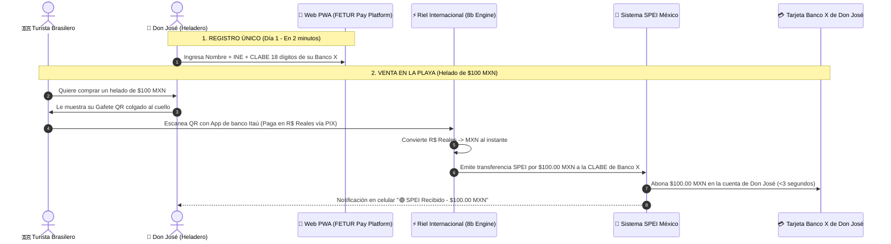

# SIMULACIÓN DE FLUJO REAL: VENDEDOR DE HELADOS EN LA PLAYA

**Paso a Paso de Registro, Cobro y Depósito SPEI a Banco X**  
**Proyecto:** Pagos Turísticos LATAM (PIX, Bre-B, Yape, Mercado Pago)  
**Caso de Uso:** Don José — Vendedor ambulante de helados en Playa del Carmen  
**Autor:** Antonio Gutiérrez — Estratega de Tecnología y Soluciones de Pago B2B  
**Fecha:** 7 de Agosto de 2026  

---

## 🍦 EL CASO DE USO: DON JOSÉ (VENDEDOR DE HELADOS)

* **Perfil:** Vendedor de helados en su carrito en la playa de Playa del Carmen.
* **Su Cuenta Actual:** Ya tiene una tarjeta de débito personal de **Banco X** (BanCoppel, Spin OXXO, BBVA, etc.).
* **Su Herramienta de Cobro:** Un gafete de acrílico colgado al cuello con el **Smart QR Oficial Caribe Mexicano Smart Pay**.

---

## 🔄 EL FLUJO PASO A PASO: DE LA COMPRA AL DEPÓSITO

---

## ❓ ¿A QUIÉN LE DICE DON JOSÉ A DÓNDE DEPOSITARLE?

1. **Don José NO habla con 8b ni llena contratos bancarios.**
2. Don José ingresa a la **Web-Landing del programa (`pay.fetur.tech/registro`)** desde el navegador de su propio celular (o es ayudado por un promotor de FETUR).
3. Escribe los **18 dígitos de la CLABE de su Banco X** en el campo *"¿Dónde quieres recibir tus ventas?"*.
4. **El Back-End lo automatiza todo:** El sistema (conectado con los rieles de 8b) guarda esa CLABE. Cada vez que un turista brasileño o colombiano escanea su gafete, el motor convierte la divisa y dispara el depósito SPEI en MXN a la tarjeta de Banco X de Don José en menos de 3 segundos.

---

## 🎯 RESUMEN EJECUTIVO:

> *"Don José solo registra su CLABE de Banco X una sola vez en el formulario web desde su celular. El motor de 8b en el back-end se encarga de recibir los Reales o Pesos del turista sudamericano, convertirlos a Pesos MXN y depositárselos vía SPEI a su tarjeta de Banco X de inmediato."*

---

*Simulación de flujo real guardada en `riviera-maya-payments`.*
