# ARQUITECTURA DE CENTRALIZACIÓN DE PAGOS: CÓMO CONECTAR A LOS COMERCIOS SIN CAMBIAR SUS TPVS NI NEGOCIAR 1 A 1

**Solución Operativa y Middleware Tecnológico:** Despliegue de APMs Sudamericanos en la Red FETUR  
**Autor:** Antonio Gutiérrez — Estratega de Tecnología y Soluciones de Pago B2B  
**Fecha:** 7 de Agosto de 2026  

---

## 🎯 EL RETO OPERATIVO

Los comercios afiliados a FETUR en Quintana Roo (hoteles, restaurantes, parques, agencias):
1. **Ya tienen TPVs físicas** de sus bancos actuales y **no quieren cambiarlas ni rentar terminales nuevas**.
2. **No van a renegociar individualmente** contratos con 10 adquirentes bancarios distintos.
3. **No aceptarán procesos de onboarding burocráticos** que interrumpan la operación diaria de su caja.

---

## 🚀 LAS 3 SOLUCIONES TECNOLÓGICAS DE CENTRALIZACIÓN (SIN CAMBIAR TPVS)

```mermaid
flowchart TD
    subgraph OPCION1 ["OPCIÓN 1: App en Smart POS (Over-The-Air OTA)"]
        A["TPV Android del Comercio"] --> B["Instalación remota de App 'FETUR APM Pay'"]
        B --> C["Cajero genera QR de PIX/Bre-B/Yape en la misma pantalla"]
    end

    subgraph OPCION2 ["OPCIÓN 2: Integración a Nivel Software PMS / POS (Soft Restaurant / Opera)"]
        D["Software de Caja del Comercio (Soft Restaurant / PMS Hotel)"] --> E["Integración de API Única con Motor PSP Aliado"]
        E --> F["Impresión de QR APM directo en la comanda o pantalla de cobro"]
    end

    subgraph OPCION3 ["OPCIÓN 3: Standee QR / Display Digital de Mostrador (Zero Hardware)"]
        G["Display / Tablet / QR Dinámico en Mostrador"] --> H["Cajero digita monto en interfaz web de FETUR"]
        H --> I["Turista escanea QR con su app de banco (Confirmación en <5s)"]
    end
```

---

### 🟢 1. LA SOLUCIÓN RECOMENDADA #1: INTEGRACIÓN PMS / POS SOFTWARE (SOFT RESTAURANT & OPERA)

En Quintana Roo, los hoteles y restaurantes **no cobran digitando el monto en la TPV aislada**, sino a través de su software de gestión de caja:
* **Restaurantes y Clubes de Playa:** El 75% utiliza **Soft Restaurant** o **Micros**.
* **Hoteles y Spas:** La mayoría utiliza **Opera PMS**, **Infor** o **Bitoon**.

#### **La Jugada Maestra:**
En lugar de ir comercio por comercio o adquirente por adquirente:
1. Se realiza **UNA SOLA INTEGRACIÓN API** con los 2 sistemas dominantes (**Soft Restaurant** y **Opera PMS**).
2. El sistema habilita el botón *"Cobro QR Sudamérica (PIX/Bre-B/Yape)"* directamente en la pantalla de la caja del sistema.
3. Al cobrar, la comanda o el ticket imprime o muestra el QR dinámico automáticamente.

**Resultado:** Se habilitan **cientos de restaurantes y hoteles de un solo golpe** sin tocar una sola TPV ni cambiar bancos.

---

### 🔵 2. LA SOLUCIÓN RECOMENDADA #2: APP OTA EN SMART POS (TERMINALES ANDROID)

Hoy más del **60% de las TPVs instaladas en Quintana Roo son Smart POS Android**.

#### **Cómo funciona:**
* No hay que cambiar la terminal.
* Vía actualización remota (*Over-The-Air*), se instala la App **FETUR Pay / Motor PSP Aliado** en el menú de la terminal.
* Cuando llega un turista sudamericano, el cajero abre la app en la misma TPV, digita el monto en MXN, se genera el QR de PIX/Bre-B/Yape, el turista paga y la terminal imprime el comprobante habitual.

---

### 🟡 3. LA SOLUCIÓN RECOMENDADA #3: DISPLAY QR DINÁMICO EN MOSTRADOR (ZERO HARDWARE)

Para comercios pequeños, mostradores de tours y recepción de hoteles boutique:
* Se le entrega al comercio un **Display QR electrónico de mostrador** o un acceso web para su tablet/teléfono de caja.
* El cajero genera el QR dinámico en 3 segundos.
* El dinero cae directamente en la cuenta bancaria en MXN vía SPEI.

---

## 🏛️ EL ROL DE FETUR COMO ENTIDAD CONCENTRADORA (CONVENIO MARCO)

 Para evitar negociaciones 1 a 1:

1. **Firma de Convenio Marco FETUR:** FETUR firma el acuerdo maestro de innovación tecnológica en representación de la red de afiliados.
2. **Digital Onboarding en 3 Minutos:** Los afiliados simplemente completan un formulario digital de 3 campos (Nombre de negocio, RFC y CLABE interbancaria para recibir sus depósitos en MXN).
3. **Cero Trámites Bancarios:** El afiliado no tiene que aperturar cuentas bancarias nuevas ni cambiar de banco.

---

*Arquitectura de centralización y despliegue tecnológico guardada en `riviera-maya-payments`.*
