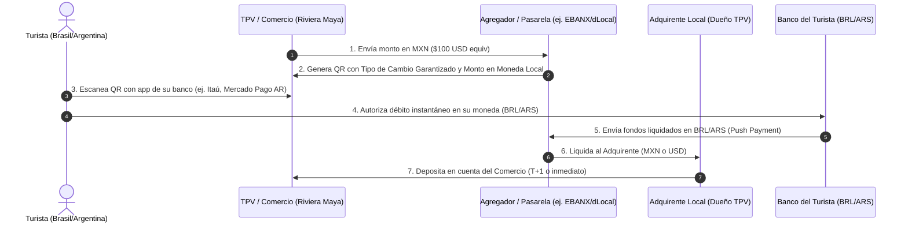

# Business Case: Métodos de Pago Locales (PIX y Transferencias) en el Caribe Mexicano
*Análisis de viabilidad financiera y operativa para la integración de pagos alternativos (APMs) en terminales punto de venta (TPV) para los mercados de Brasil y Argentina.*

---

## 1. Oportunidad del Mercado (Dimensionamiento y TAM)

El Caribe Mexicano (Cancún, Riviera Maya, Cozumel, Isla Mujeres, Puerto Morelos) recibe un flujo masivo de turistas sudamericanos de alto valor.

### Proyección de Flujo y TAM (Total Addressable Market) 2025-2026

| Mercado | Pasajeros Anuales Proyectados | Gasto Promedio por Estancia (USD) | TAM: Volumen Total de Gasto (USD) |
| :--- | :---: | :---: | :---: |
| **Brasil** (Con visa electrónica) | 150,000 | $2,325 | **$348,750,000** |
| **Argentina** | 220,000 | $1,400 | **$308,000,000** |
| **Total Combinado** | **370,000** | **$1,775 (Promedio)** | **$656,750,000** |

*   **Mercado Potencial Inmediato (SOM - 10% de penetración inicial):** **$65,675,000 USD** anuales en volumen de transacciones procesadas mediante códigos QR.

---

## 2. El Dolor del Turista y Fricción de Tarjetas Internacionales (Data Real)

El uso de tarjetas de crédito tradicionales genera una enorme ineficiencia y fricción debido a impuestos nacionales, tipos de cambio desfavorables y rechazos de transacciones.

### Fricción para el Turista Brasileño (Tarjeta vs. PIX)
*   **Impuesto IOF (Imposto sobre Operações Financeiras):** En Brasil, el gobierno grava los consumos con tarjeta en el exterior con un **3.5%** de IOF (establecido para 2025/2026).
*   **Spread de Tipo de Cambio Bancario (FX Markup):** Los bancos brasileños aplican un margen de ganancia de entre **4% y 7%** sobre el tipo de cambio oficial (PTAX) al procesar consumos con tarjeta de crédito internacional.
*   **Tasa de Rechazo:** ~15% de las compras internacionales son declinadas por los emisores brasileños debido a algoritmos de prevención de fraude.
*   **Fricción Total con Tarjeta:** **7.5% - 10.5%** de sobrecosto para el turista.

### Fricción para el Turista Argentino (Tarjeta vs. Transferencia)
*   **Impuestos y Percepciones (2026):** Tras la finalización del Impuesto PAIS a finales de 2025, las compras con tarjeta en moneda extranjera en Argentina continúan sujetas a una **percepción del 30%** a cuenta del Impuesto a las Ganancias o Bienes Personales.
*   **Límites de Tarjeta:** La devaluación constante y las restricciones bancarias en Argentina reducen el límite de compra internacional de las tarjetas en dólares, impidiendo pagos grandes (ej. hoteles o tours premium).
*   **Fricción Total con Tarjeta:** **30% - 32%** de sobrecosto impositivo o inhabilitación por falta de límite.

---

## 3. Modelo Operativo del Flujo de Pago (QR en TPV)

La solución consiste en integrar una API de pagos transfronterizos (como dLocal, EBANX o Antom) en las terminales punto de venta (TPVs) físicas y sistemas de los comercios.

### Características Técnicas Clave:
1.  **Tipo de Cambio Fijo:** El QR bloquea el tipo de cambio por 5-10 minutos, protegiendo al turista y al negocio de la volatilidad cambiaria.
2.  **Transacción Push (Sin contracargos):** Al ser transferencias autorizadas por biometría/PIN en la app bancaria del cliente, la tasa de fraude y contracargos disminuye a **0%**.

---

## 4. Análisis de Costos y Estructura de Margen (Business Case)

A continuación se compara el costo transaccional de una compra de **$1,000 USD** en la Riviera Maya.

### Comparativa Transaccional: Tarjeta Internacional vs. Pago Local QR

| Concepto | Tarjeta de Crédito Tradicional | Alternativa Local QR (PIX / Transferencia) | Diferencia / Ahorro |
| :--- | :---: | :---: | :---: |
| **Monto Neto para Comercio** | $1,000.00 USD | $1,000.00 USD | - |
| **MDR (Comisión Comercio)** | 3.50% ($35.00 USD) | 2.00% ($20.00 USD) | **+ $15.00 USD de margen para el comercio** |
| **Costo FX + Impuestos para el Turista** | ~8.50% ($85.00 USD equiv) | ~5.00% ($50.00 USD equiv) | **+ $35.00 USD de ahorro para el turista** |
| **Riesgo Contracargo/Fraude** | 0.50% ($5.00 USD valor riesgo) | 0.00% ($0.00 USD) | **Eliminación total del riesgo** |

*El uso de pagos locales con código QR reduce el costo total de la transacción en un **5% promedio**, beneficiando tanto al turista (que gasta más en el destino) como al comercio.*

---

## 5. Modelo de Compartición de Ingresos (Revenue Share)

El modelo financiero de distribución de ingresos incentiva a todos los actores de la cadena de valor:

### Distribución de la Tasa Transaccional (2.0% MDR + 1.0% FX Spread = 3.0% Take Rate Total)

1.  **Agregador / Procesador de Pago Transfronterizo (1.50%):**
    *   Cubre la infraestructura tecnológica del QR.
    *   Cubre el costo de la repatriación de capitales de Brasil/Argentina a México y la conversión de moneda (FX hedging).
2.  **Adquirente Local / Dueño de las TPVs (0.75%):**
    *   Recibe este porcentaje por habilitar la actualización de software en sus terminales físicas para mostrar el código QR.
    *   Incentiva la distribución masiva en su red de comercios existentes.
3.  **Comercio / Dueño del Negocio (Ahorro directo + Rebate opcional 0.75%):**
    *   El comercio se beneficia de un MDR de solo **2.0%** frente al 3.5% de tarjeta (1.5% de ahorro directo).
    *   Opcionalmente, en comercios de altísimo volumen (ej. Parques Xcaret, grandes cadenas de hoteles), el adquirente puede compartir un **0.25%** del volumen procesado.

### Proyección de Ingresos para un Adquirente/Agregador en Riviera Maya
Si se procesan **$50,000,000 USD** anuales (SOM):

*   **Ingresos Brutos del Sistema (3.0%):** $1,500,000 USD.
*   **Ingresos para el Agregador (1.5%):** $750,000 USD.
*   **Ingresos para el Adquirente (0.75%):** $375,000 USD (Adicionales a su renta de terminales).
*   **Ahorro total para Comercios (1.5% MDR):** $750,000 USD en comisiones no pagadas a redes de tarjetas.

---

## 6. Mitigación de Barreras de Adopción (La Fricción del QR en México)

Es una realidad documentada que las iniciativas locales de pago por QR en México (como CoDi de Banxico) han tenido una adopción muy baja entre comercios y consumidores. Sin embargo, este proyecto no se enfrenta a los mismos problemas de CoDi debido a diferencias estructurales en incentivos y uso:

### ¿Por qué CoDi falló y por qué esta solución es diferente?

| Factor de Fricción | El Problema de CoDi | La Solución con PIX / Transferencia Transfronteriza |
| :--- | :--- | :--- |
| **Incentivo para el Banco/Adquirente** | **Nulo.** La ley obligaba a los bancos a procesar CoDi gratis (0% comisión), por lo que no invirtieron en promoverlo ni en actualizar software. | **Alto.** El adquirente local gana un **0.75% de comisión** sobre el volumen, lo que incentiva activamente a redes como Clip o Netpay a desplegarlo. |
| **Workflow del Comercio** | **Fricción Operativa.** El comercio tenía que abrir su banca móvil, generar un QR estático y mostrárselo al cliente en un celular propio. | **Integración Nativa.** El QR dinámico aparece en la **pantalla de la TPV que ya usan**. El cajero no cambia su proceso habitual de cobro. |
| **Temor Fiscal (SAT)** | **Fobia Fiscal.** Los pequeños comercios temen que el SAT rastree sus ingresos domésticos si digitalizan transacciones de bajo valor que solían cobrar en efectivo. | **Transacciones Extranjeras.** Los comercios turísticos ya están 100% fiscalizados (hoteles, restaurantes grandes, operadoras de tours) y ya cobran con tarjeta. No hay incremento en el temor fiscal. |
| **Hábitos del Consumidor** | **Resistencia del Mexicano.** El consumidor mexicano prefiere el efectivo (92% de uso en retail) y desconfía de las apps de banca. | **Hábito del Turista.** El brasileño tiene el hábito de pagar con PIX (usado por el 90% de su población). El QR representa **su preferencia**, no una imposición. |
| **Beneficios de Contracargo** | **Inexistente.** CoDi reemplazaba transferencias sencillas o efectivo, donde el fraude comercial es bajo. | **Crítico.** El comercio turístico sufre altas tasas de contracargo por tarjetas clonadas. Al ser pagos "Push" (autorizados por la app del turista), el riesgo de contracargo baja a **0%**. |

*El enfoque del negocio no es convencer al comercio mexicano de cambiar el efectivo por QR en general, sino ofrecerle una herramienta para capturar ventas de turistas de alto ticket (que no cargan efectivo por seguridad) que de otro modo se perderían o costarían el doble en comisiones.*

---

## 7. Estrategia de Implementación y Actores Clave

Para desplegar esta solución sin la fricción de vender comercio por comercio, la estrategia debe enfocarse en **canales B2B mayoristas y agregadores de TPV**:

1.  **Integración a Nivel Adquirente (Ej. Fiserv, Getnet, Clip, Netpay):**
    *   Habilitar el QR dinámico en su software de TPV. Cuando la TPV detecta una tarjeta brasileña o el cajero selecciona "Pago Sudamérica", la pantalla muestra el QR de PIX/Transferencia.
2.  **Alianza con la Asociación de Hoteles (Liderada por Jesús Almaguer):**
    *   Presentar el Business Case demostrando cómo recuperar parte de los **$400 millones de dólares** perdidos por las barreras migratorias, facilitando al máximo el pago de los brasileños que logran viajar.
3.  **Integración en Motores de Reserva (Booking Engines) y PMS de Hoteles:**
    *   Habilitar el pago con PIX al momento de la reserva en línea para asegurar las tarifas antes de la llegada del turista al hotel.

---

## 8. Fuentes y Citas Bibliográficas

Para fundamentar técnicamente este Business Case ante socios comerciales, las cifras de pasajeros e impacto financiero provienen de las siguientes fuentes oficiales e institucionales:

1.  **Históricos del Flujo de Turistas Brasileños (163,418 en 2018 y caída subsecuente):**
    *   **Fuente:** *Secretaría de Turismo de Quintana Roo (SEDETUR)* a través de sus reportes estadísticos anuales de "Indicadores Turísticos".
    *   **Metodología:** Basado en los registros de internación aérea de la *Unidad de Política Migratoria, Registro e Identidad de Personas (UPMRIP)* de la Secretaría de Gobernación (SEGOB) de México.
    *   **Análisis Institucional:** Estudios de impacto y reportes del *Centro de Investigación y Competitividad Turística Anáhuac (CICOTUR)*.

2.  **Datos Recientes del Primer Bimestre 2024 (69,090 argentinos y 40,124 brasileños):**
    *   **Fuente:** *Secretaría de Turismo Federal de México (SECTUR)* / Portal *DATATUR*.
    *   **Documento:** Reporte de *Llegada de Turistas Internacionales vía Aérea por País de Nacionalidad (Enero-Febrero 2024)*.

3.  **Pérdida Estimada de $400 Millones de Dólares en el Caribe Mexicano:**
    *   **Vocero:** **Jesús Almaguer Salazar**, Presidente del *Consejo Hotelero del Caribe Mexicano* y de la *Asociación de Hoteles de Cancún, Puerto Morelos e Isla Mujeres*.
    *   **Cita:** Comunicados oficiales del sector hotelero reportados por la prensa financiera mexicana (como *El Economista* y *Excélsior*) detallando la pérdida acumulada de divisas por la cancelación del visado electrónico brasileño desde fines de 2022.

